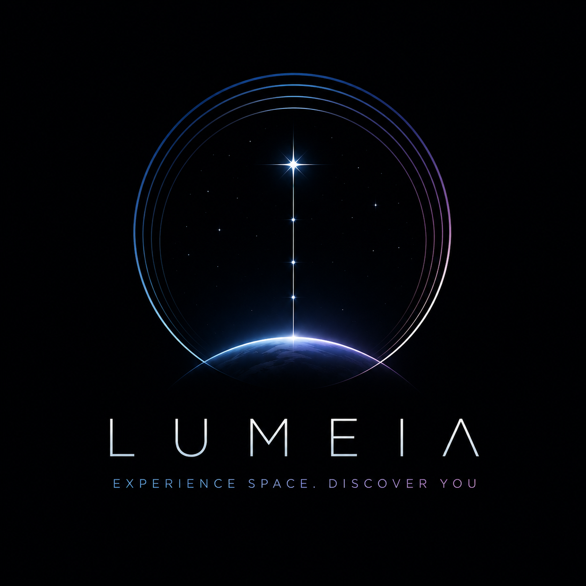

# SpaceFlight



Crewed Spaceflight Assistance System — JavaFX 24 / Java 25

[](https://openjdk.org/)
[](https://openjfx.io/)
[](https://maven.apache.org/)


SpaceFlight is a JavaFX prototype created in the university module "Ausgewählte Themen der IT (ATdIT)". It simulates the space‑flight phase of a space‑tourism mission and supports ground crew and passengers with AI‑driven health monitoring, prioritization and alert workflows. The goal of the application is to ensure a happy and safe customer experience.

---

## Table of Contents

- [About the Project](#about-the-project)
- [Architecture](#architecture)
- [Project Structure](#project-structure)
- [License](#license)
- Documentation
  - [Sales Pitch (Wiki)](https://github.com/Louisbrk/ATdIT2/wiki/Start‐up-Marketing-Pitch)
  - [BPMN Diagrams](docs/BPMN) (or see Signavio Folder)
  - [Mockups](docs/MockUps)
  - [Personas](docs/Personas)
  - [Technical Documentation](docs/Technical_Documentation.md)
  - [User Guide](docs/User_Documentation.md)

---

## About the Project

SpaceFlight is a desktop application that simulates a shuttle flight from takeoff to landing. The focus is on:
- AI‑based classification of each passenger’s health status on every tick (k‑NN with safety rules).
- Crew dashboards (base station, emergency view), an AI‑Health dashboard, and passenger/stewardess UIs.
- Alert handling (emergency) and psychological support requests with workflows and listener callbacks.
- Experience modes (RELAXED, NORMAL, ACTION) with distinct UI themes.
- Emergency landing flow.

Behind the UI, clearly separated services (simulation, vital generation, health evaluation, alerts) and a snapshot boundary prepare the codebase for a future client/server split.

---

## Architecture

Layered single‑process architecture with clear interfaces:

- Bootstrap / Composition Root: `app` (`Launcher`, `SpaceFlightApp`, `AppContext`)
- Presentation: `ui.*` (JavaFX views, partial MVP in passenger dashboard)
- Service / Use‑Case: `simulation`, `health`, `alert`
- Domain Model: `model` (Passenger, VitalSigns, Snapshots, enums)

---
## Project Structure

```text
org.example.spaceflight
├── app                  # Bootstrap & composition (Launcher, SpaceFlightApp, AppContext)
├── model                # Domain: Passenger, VitalSigns, Snapshots, enums
├── simulation           # Tick engine, flight phases, vital targets, headless runner
├── health               # HealthEvaluationService, kNN classifier, profiles, orchestrator
├── alert                # Alerts & psychological support (services, incidents, severity)
└── ui                   # JavaFX views (shared, basestation, aihealth, passenger, simulation)
```

Total: ~80 classes across 8 packages (see detailed docs).

---

## License

This repository is a university/educational project developed as part of the "Ausgewählte Themen der IT (ATdIT)" module at HWG Ludwigshafen. All rights are reserved by the authors. 

The project was created by Louis Burckel, Wenhuan Liang, Valentin Reifke, Tim Vetter and Vivienne Wühl.
