# Technical Documentation — SpaceFlight

## Table of Contents

1. [Project Overview](#1-project-overview)
2. [Technology Stack](#2-technology-stack)
3. [Architecture Overview](#3-architecture-overview) _(Package: app)_
4. [Package Structure](#4-package-structure)
5. [Domain Model](#5-domain-model) _(Package: model)_
6. [Service Layer](#6-service-layer)
7. [Simulation Engine](#7-simulation-engine) _(Package: simulation)_
   - 7.1 [Overview](#71-overview)
   - 7.2 [Class diagram](#72-class-diagram)
   - 7.3 [Simulation control lifecycle](#73-simulation-control-lifecycle)
   - 7.4 [Runtime contracts](#74-runtime-contracts)
   - 7.5 [Main tick pipeline](#75-main-tick-pipeline)
   - 7.6 [Emergency landing](#76-emergency-landing)
   - 7.7 [Flight profile](#77-flight-profile)
   - 7.8 [Vital generation](#78-vital-generation)
   - 7.9 [Experience mode](#79-experience-mode)
8. [AI Health Classification](#8-ai-health-classification) _(Package: health)_
9. [Alert and Psychological Support System](#9-alert-and-psychological-support-system) _(Package: alert)_
   - 9.1 [Overview](#91-overview)
   - 9.2 [Class Diagram](#92-class-diagram)
   - 9.3 [Alert Lifecycle](#93-alert-lifecycle)
   - 9.4 [Service API Semantics](#94-service-api-semantics)
   - 9.5 [Alert Flow](#95-alert-flow)
10. [UI Layer](#10-ui-layer) _(Package: ui)_
11. [Build and Run](#11-build-and-run) _(Package: app)_
- [Appendix A: Logging](#appendix-a-logging)
- [Appendix B: Behavioral Guarantees and Limitations](#appendix-b-behavioral-guarantees-and-limitations)

---

## 1. Project Overview

SpaceFlight is a JavaFX Software prototype developed for the "Ausgewählte Themen der IT" university course by Andreas Heck und Patrick Gutgesell. It simulates the **Space Flight** phase of a space tourism company (from takeoff to shuttle landing with the goal of improving **Customer Satisfaction** by reducing passengers' mental and physical stress during the flight.

### Business Problem

Passengers experience high mental and physical load during space flight, which directly impacts customer satisfaction, perceived safety and brand loyalty.

### Core Capability

The software provides **AI-driven health monitoring and passenger prioritization** based on simulated live vital-sign data. A rule-based k-Nearest Neighbours classifier evaluates each passenger every simulation tick and assigns a three-tier severity: GREEN (normal), YELLOW (warning), RED (critical).

### Supported Subprocesses

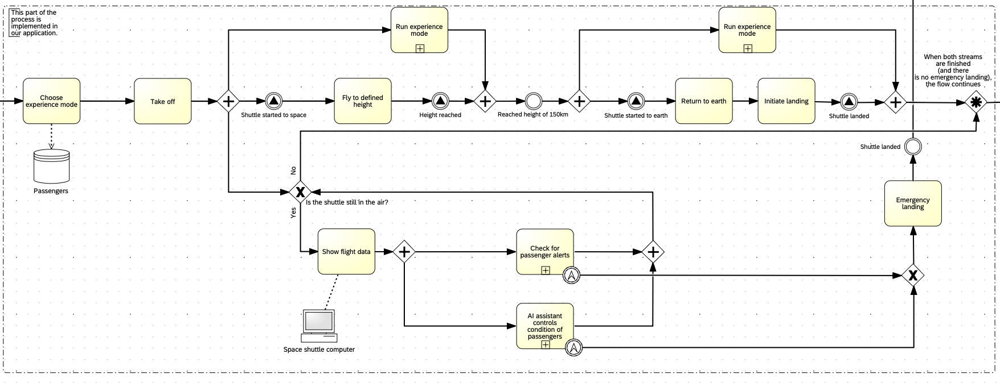

| Subprocess | Description |
|---|---|
| Space Flight Main Flow | Simulation of the flight from takeoff through orbit to landing |
| AI Health Monitoring | Real-time health classification and passenger prioritization |
| Emergency Alert Handling | Manual and health-triggered alert incidents with crew workflows |
| Experience Mode | Passenger-selectable flight modes with different dashboards and a psychological support in one specific mode |

### Users

| Role                  | Responsibility                                                                                     |
|-----------------------|----------------------------------------------------------------------------------------------------|
| **Base Station Crew** | Monitors the flight, passenger conditions and critical incidents from Earth                        |
| **Doctors**           | Monitors the passengers health condition, supports the Stewardess remote and handles Emergencies   |
| **Psychologist**      | Takes care of passengers with psychological problems during the flight                             |
| **Passenger**         | Experiences the flight; can trigger alerts, request help, switch experience mode                   |
| **Stewardess**        | Handles in-flight incidents and medical actions                                                    |

---

## 2. Technology Stack

| Component | Technology | Version |
|---|---|---------|
| Language | Java | 25      |
| UI Framework | JavaFX | 24      |
| Build Tool | Maven | 4.0     |
| UI Construction | Programmatic (no FXML) | —       |
| Styling | Inline JavaFX CSS + Theme classes | —       |


**Dependencies:** Only `javafx-controls` (no external libraries).

---

## 3. Architecture Overview

The application follows a **layered single-process architecture** with clear interface boundaries between presentation, services and the domain model.

### 3.1 Layered Architecture

| Layer | Main Package(s) | Responsibility |
|---|---|---|
| Bootstrap / Composition Root | `app` (`Launcher`, `SpaceFlightApp`, `AppContext`) | Application startup, dependency wiring, lifecycle |
| Presentation | `ui.*` | JavaFX views and UI interaction logic (including MVP in passenger dashboard) |
| Service / Use-Case | `simulation`, `health`, `alert` | Flight progression, vital generation, health classification, incident workflows |
| Domain Model | `model` | Passenger, shuttle state, snapshots, enums and value objects |

`SpaceFlightApp` is the orchestration center at runtime. `AppContext` is the only class that knows concrete service implementations.

### 3.2 Architectural Patterns

#### Service Layer
- Service interfaces define use-cases (`SimulationService`, `FlightSimulationService`, `VitalSignsGenerator`, `HealthEvaluationService`, `AlertService`, `PsychologicalSupportService`).
- UI classes depend on interfaces, not concrete implementations.
- `AppContext` binds interfaces to local defaults (`Default*` classes).

#### Composition Root
- `Launcher.main()` starts JavaFX.
- `SpaceFlightApp.start()` creates and wires the application graph.
- `AppContext` is the composition root registry for concrete services.

#### Observer / Event-Driven Updates
- Tick-based updates: `SimulationService.addTickListener(...)`.
- Alert events: callback registration (e.g. alert/psych request listeners).
- JavaFX thread handoff: `Platform.runLater(...)` updates all UI views safely.

#### MVP (where used)
- Passenger dashboard follows MVP split (`PassengerDashboardView` + `PassengerDashboardPresenter`).
- Presenter contains interaction/domain logic; view focuses on rendering and event forwarding.

### 3.3 High-Level Component Diagram

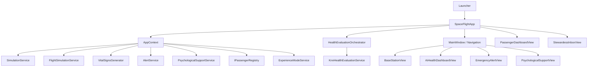

> **Note:** The health evaluation subsystem (`HealthEvaluationOrchestrator` + `KnnHealthEvaluationService`) is created directly in `SpaceFlightApp`, not via `AppContext`.

### 3.4 Runtime Data Flow (per simulation tick)

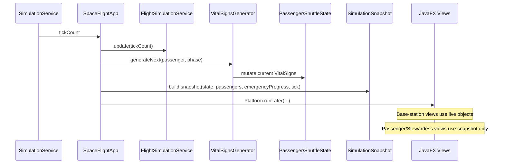

--- 

## 4. Package Structure

```
org.example.spaceflight
├── app                              Bootstrap & composition root
│   ├── Launcher                     JVM entry point
│   ├── SpaceFlightApp               JavaFX Application, lifecycle, wiring
│   └── AppContext                   Service registry (only class knowing concretions)
│
├── model                            Domain entities & value objects
│   ├── Passenger                    Passenger with health state, mode, demographics
│   ├── Stewardess                   Crew member (extends Passenger)
│   ├── VitalSigns                   5 monitored vitals snapshot
│   ├── ShuttleState                 Mutable shuttle telemetry
│   ├── SimulationSnapshot           Immutable tick data for client views
│   ├── PassengerSnapshot            Immutable per-passenger copy
│   ├── SimulationConfig             User-configured simulation parameters
│   ├── PassengerRegistry            Hardcoded passenger manifest
│   ├── IPassengerRegistry           Interface for passenger lookup
│   ├── HealthStatus                 Enum: GREEN, YELLOW, RED
│   ├── FlightPhase                  Enum: PRE_FLIGHT → ASCENT → ORBIT → DESCENT → LANDED
│   ├── ExperienceMode               Enum: RELAXED, NORMAL, ACTION (with phase factors)
│   └── Gender                       Enum: MALE, FEMALE
│
├── simulation                       Flight simulation engine
│   ├── SimulationService            Interface: tick loop control
│   ├── DefaultSimulationService     JavaFX Timeline tick engine
│   ├── FlightSimulationService      Interface: flight state progression
│   ├── DefaultFlightSimulationService Flight phases, emergency descent
│   ├── VitalSignsGenerator          Interface: vital-sign generation
│   ├── DefaultVitalSignsGenerator   Trend-based generation with personal baselines
│   ├── ExperienceModeService        Interface: mode change commands
│   ├── DefaultExperienceModeService Mode changes with logging
│   ├── IVitalTargetProvider         Interface: phase/mode target computation
│   ├── DefaultVitalTargetProvider   Applies phase × mode factors to baselines
│   ├── PersonalProfile              Per-passenger vital baseline (package-private helper)
│   └── PhaseTarget                  Target center & range for vital generation (package-private helper)
│
├── health                           Health evaluation & classification
│   ├── HealthEvaluationService      Interface: classify one passenger
│   ├── KnnHealthEvaluationService   k-NN classifier (active, k=5)
│   ├── WeightedZScoreEvaluationService Z-score classifier (alternative)
│   ├── DefaultHealthEvaluationService Simple thresholds (legacy)
│   ├── IHealthEvaluationOrchestrator Interface: batch evaluation
│   ├── HealthEvaluationOrchestrator Runs evaluation for all passengers each tick
│   ├── HealthEvaluationResult       Immutable: overall + per-vital statuses
│   ├── VitalType                    Enum: BPM, SPO2, SYSTOLIC_BP, DIASTOLIC_BP, RESP_RATE
│   ├── VitalProfile                 Population baseline (mean, stdDev, weight)
│   ├── VitalProfileTable            Demographic lookup (18 segments)
│   ├── IVitalProfileProvider        Interface: profile lookup
│   ├── AgeGroup                     Enum: YOUNG, MIDDLE, SENIOR
│   ├── TrainingCase                 One labelled row from CSV
│   ├── ITrainingDataLoader          Interface: load training data
│   └── CsvTrainingDataLoader        Loads 140 cases from training_data.csv
│
├── alert                            Alert & psychological support
│   ├── AlertService                 Interface: alert incident management
│   ├── DefaultAlertService          In-memory alert store with listeners
│   ├── AlertIncident                Alert model with lifecycle
│   ├── Incident                     Common interface for alert types
│   ├── PsychologicalSupportService  Interface: psych request management
│   ├── DefaultPsychologicalSupportService In-memory psych store
│   ├── PsychologicalIncident        Psych request with severity
│   └── PsychSeverity                Enum: LOW, MEDIUM, HIGH
│
└── ui                               JavaFX views
    ├── shared/                      Common components
    │   ├── MainWindow               Root container with tab switching
    │   ├── NavigationBar            5-tab top navigation
    │   ├── UIColors                 Centralized color constants
    │   └── RouteMapCanvas           Animated flight route visualization
    ├── basestation/                 Crew dashboards
    │   ├── BaseStationView          Crew control panel orchestrator
    │   ├── FlightInfoPanel          Telemetry sidebar + emergency button
    │   ├── PassengerOverviewPanel   2-column passenger card grid
    │   ├── PassengerCardView        Compact passenger card with alert dot
    │   ├── PassengerDetailView      Slide-out detail panel
    │   ├── EmergencyAlertView       Active alert incident dashboard
    │   ├── AlertIncidentCard        Alert row card
    │   ├── PsychologicalSupportView Psych support dashboard
    │   └── PsychIncidentCard        Psych row card
    ├── aihealth/                    AI Health dashboard
    │   ├── AiHealthDashboardView    3-column classification layout
    │   ├── AiHealthPassengerCard    Passenger card with 4 trend charts
    │   └── VitalSignsChartCanvas    Canvas-based vital line chart
    ├── passenger/                   Passenger dashboards
    │   ├── PassengerDashboardView   Per-passenger flight UI
    │   ├── PassengerDashboardPresenter MVP presenter (domain logic)
    │   ├── PassengerSettingsDialog   Settings modal (volume, brightness, language)
    │   ├── StewardessInboxView      Stewardess incident inbox
    │   ├── StewardessIncidentCard   Compact incident card
    │   └── theme/                   Experience mode themes
    │       ├── PassengerDashboardTheme  Interface: apply styling
    │       ├── DashboardSkin            All style-affected nodes
    │       ├── ThemeFactory             Mode → Theme lookup
    │       ├── RelaxedTheme             Soft green styling
    │       ├── NormalTheme              Neutral blue-grey styling
    │       └── ActionTheme              Dark navy + orange styling
    └── simulation/
        └── SimulationConfigView     Pre-flight configuration & control
```

**Total:** ~81 Java files across 8 packages.

---

## 5. Domain Model

The `model` package contains the core domain classes for the space tourism simulation. It defines the central data objects, enumerations, and interfaces that represent the state of passengers, the shuttle, and the simulation.

### 5.1 Core Class Diagram (Overview)

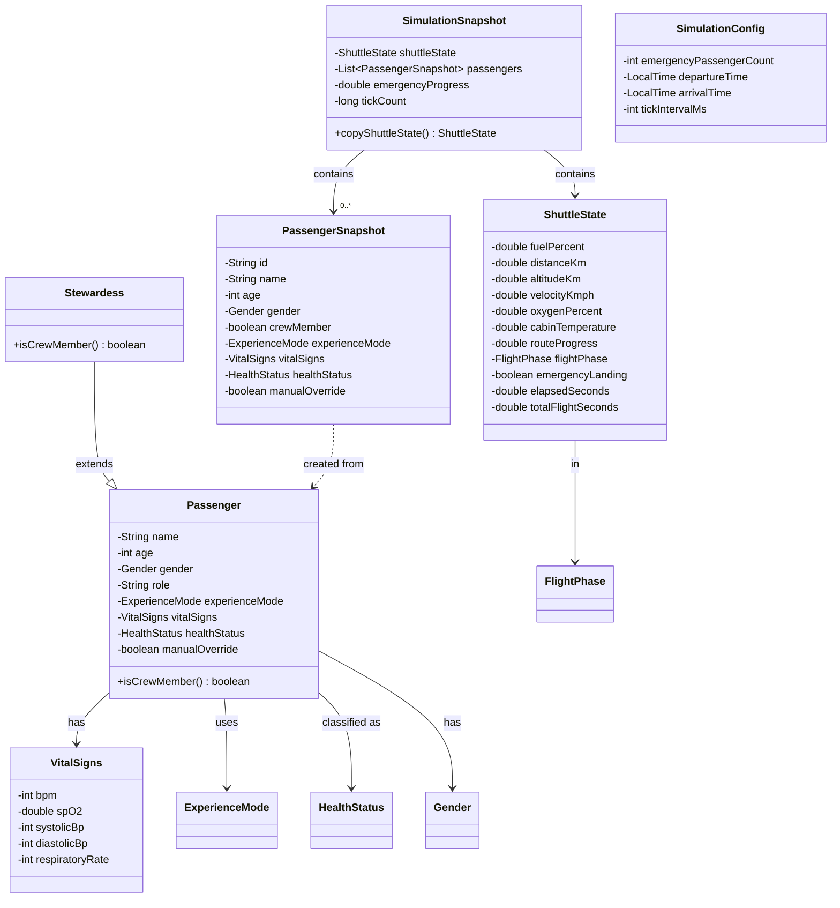

#### 5.1.1 `Passenger`
**Purpose**: Central entity for space tourism passengers, containing personal data, health status, and experience mode.

##### Attributes:
- `String name` - Passenger's name
- `int age` - Age
- `Gender gender` - Gender
- `String role` - Role/Profession
- `ExperienceMode experienceMode` - Selected experience mode
- `VitalSigns vitalSigns` - Current vital signs
- `HealthStatus healthStatus` - Health status
- `boolean manualOverride` - Manual override status

##### Key Methods:
```java
// Constructor
public Passenger(String name, int age, Gender gender, String role){}

// Getters/Setters with logging
public void setHealthStatus(HealthStatus healthStatus){}
public void setManualOverride(boolean manualOverride){}

// Type identification
public boolean isCrewMember(){} // Default: false
```

##### Special Features:
- Logging for state changes (HealthStatus, ManualOverride)
- Equals/HashCode based on name
- Default ExperienceMode: NORMAL
- Default HealthStatus: GREEN

#### 5.1.2 `Stewardess`
**Purpose**: Crew member; inherits from `Passenger` with crew identification.

```java
public class Stewardess extends Passenger {
    public Stewardess(String name, int age, Gender gender){}
    
    @Override
    public boolean isCrewMember() { return true; }
}
```

#### 5.1.3 `VitalSigns`
**Purpose**: A snapshot of the five monitored vital signs at a specific point in time.

##### Attributes:
- `int bpm` - Heart rate (beats per minute)
- `double spO2` - Oxygen saturation
- `int systolicBp` - Systolic blood pressure
- `int diastolicBp` - Diastolic blood pressure
- `int respiratoryRate` - Respiratory rate

```java
public VitalSigns(int bpm, double spO2, int systolicBp, int diastolicBp, int respiratoryRate){}
```
→ No setters, as they are not needed: values are not modified here.

#### 5.1.4 `ShuttleState`
**Purpose**: A mutable snapshot of all shuttle telemetry values ​​for a single simulation tick.

##### Telemetry Attributes:
- `double fuelPercent` - Fuel level in percent (Default: 100.0)
- `double distanceKm` - Distance traveled
- `double altitudeKm` - Altitude
- `double velocityKmph` - Velocity
- `double oxygenPercent` - Oxygen level in percent (Default: 100.0)
- `double cabinTemperature` - Cabin temperature (Default: 21.0°C)
- `double routeProgress` - Route progress (0.0–1.0)
- `FlightPhase flightPhase` - Current flight phase
- `boolean emergencyLanding` - Emergency landing status
- `double elapsedSeconds` - Elapsed time
- `double totalFlightSeconds` - Total flight duration (Default: 3000s = 50min)

> **Note:** `DefaultFlightSimulationService` overrides this at startup with `600s` (10 min real time).

#### 5.1.5 `SimulationSnapshot`
**Purpose**: An immutable snapshot of the complete simulation state at a specific tick.

**Design Principle**: The sole data boundary between the simulation and the UI. Each view receives such a snapshot rather than live references.

##### Attributes:
- `ShuttleState shuttleState` – Defensive copy of the shuttle state
- `List<PassengerSnapshot> passengers` – List of all passenger snapshots
- `double emergencyProgress` – Emergency progress
- `long tickCount` – Tick counter

##### Special Features:
- `copyShuttleState()` creates a defensive copy of all `ShuttleState` values
- Stream-based conversion of passengers into snapshots

#### 5.1.6 `PassengerSnapshot`
**Purpose**: An immutable data snapshot of a passenger at a specific simulation tick.

**Design Principle**: Decoupling of views from live `Passenger` objects.

##### Constructor:
```java
public PassengerSnapshot(Passenger p){} // Copies all relevant data
```

##### All getters are read-only (no setters).

#### 5.1.7 `SimulationConfig`
**Purpose**: User-defined settings for controlling the simulation.

##### Configuration Parameters:
- `int emergencyPassengerCount` - Number of emergency passengers (Default: 0)
- `LocalTime departureTime` - Departure time (Default: 07:00)
- `LocalTime arrivalTime` - Arrival time (Default: 07:10)
- `int tickIntervalMs` - Tick interval in milliseconds (Default: 500ms)

→ No setter for tickIntervalMs, as we do not have a UI for it at this time.

### 5.2 Enums

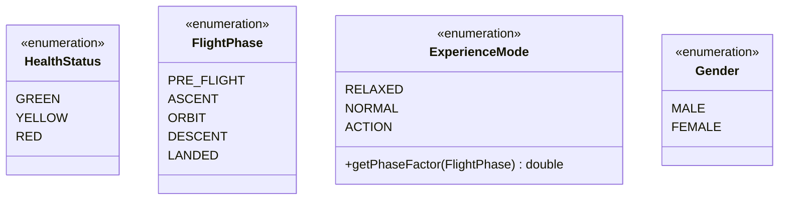

#### 5.2.1 `HealthStatus`
**Purpose**: Three-tier health classification.

```java
public enum HealthStatus {
    GREEN,   // Normal
    YELLOW,  // Warning
    RED      // Critical
}
```

#### 5.2.2 `FlightPhase`
**Purpose**: Represents the five main phases of a spaceflight.

```java
public enum FlightPhase {
    PRE_FLIGHT,  // Before launch
    ASCENT,      // Ascent
    ORBIT,       // In orbit
    DESCENT,     // Descent
    LANDED       // Landed
}
```

#### 5.2.3 `ExperienceMode`
**Purpose**: Defines three distinct experience modes that influence the extent to which physiological effects are amplified during various flight phases.

```java
public enum ExperienceMode {
    RELAXED, NORMAL, ACTION
}
```

**Modes and their Phase Factors**:

| Flight Phase | RELAXED | NORMAL | ACTION |
|------------|---------|--------|--------|
| PRE_FLIGHT | 0.4     | 1.0    | 1.5    |
| ASCENT     | 0.7     | 1.0    | 1.2    |
| ORBIT      | 1.0     | 1.0    | 1.0    |
| DESCENT    | 0.8     | 1.0    | 1.2    |
| LANDED     | 1.2     | 1.0    | 0.7    |

**Key Features**:
- Abstract method `getPhaseFactor(FlightPhase phase)` for the Strategy pattern
- RELAXED: A more relaxed experience with reduced physiological effects
- ACTION: A more adventurous experience with amplified effects

#### 5.2.4 `Gender`
**Purpose**: Biological sex for selecting the correct demographic vital sign baselines.

```java
public enum Gender {
    MALE,
    FEMALE
}
```

### 5.3 Registry/Container

#### 5.3.1 `IPassengerRegistry`
**Purpose**: Interface for accessing the passenger manifest and crew.

```java
public interface IPassengerRegistry {
    Stewardess getStewardess();
    List<Passenger> getPassengers();
    List<Passenger> getAllPersons(); // Crew + Passengers
}
```

### 5.3.2 `PassengerRegistry`
**Purpose**: Concrete implementation featuring a fixed passenger manifest for the demo flight. (hardcoded)

#### Fixed Demo Passengers:
1. **Jennifer Monroe** (35, CEO) - RELAXED Mode
2. **Ben Cooper** (51, Engineer) - NORMAL Mode
3. **Peter Mayer** (15, Student) - RELAXED Mode
4. **Sarah Chen** (42, Scientist) - ACTION Mode
5. **Marcus Webb** (29, Journalist) - NORMAL Mode
6. **Lisa Berger** (38, Researcher) - ACTION Mode

#### Crew:
- **Anne Bright** (27, Stewardess)

---

## 6. Service Layer

The Service Layer encapsulates all application use-cases behind interfaces and keeps UI code independent from concrete implementations.

### 6.1 Purpose of the Service Layer

- Centralizes core behavior (simulation timing, flight state, vital generation, alerts, psych support, mode changes).
- Exposes stable contracts to the UI.
- Allows implementations to be replaced (e.g., local in-memory today, remote API later) without rewriting views.

### 6.2 Core Service Contracts and Default Implementations

| Interface | Default Implementation | Responsibility |
|---|---|---|
| `SimulationService` | `DefaultSimulationService` | Tick loop control (start/stop/listeners) |
| `FlightSimulationService` | `DefaultFlightSimulationService` | Flight phase progression and emergency landing flow |
| `VitalSignsGenerator` | `DefaultVitalSignsGenerator` | Generates next vital-sign values per passenger and phase |
| `AlertService` | `DefaultAlertService` | Emergency incident lifecycle and listeners |
| `PsychologicalSupportService` | `DefaultPsychologicalSupportService` | Psychological support requests and listeners |
| `IPassengerRegistry` | `PassengerRegistry` | Passenger lookup/list for runtime |
| `ExperienceModeService` | `DefaultExperienceModeService` | Mode changes (`RELAXED`, `NORMAL`, `ACTION`) |

> **Note:** The health evaluation subsystem (`HealthEvaluationOrchestrator`, `KnnHealthEvaluationService`) is instantiated directly in `SpaceFlightApp` rather than via `AppContext`, since it is consumed only by the AI Health dashboard view.

### 6.3 How `AppContext` works

`AppContext` is the service registry and local composition container:

1. In its constructor, it instantiates all default concrete services exactly once.
2. It stores them as interface types.
3. It exposes typed getters used by orchestration/UI classes.

This gives a single source of wiring truth:

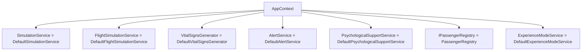

### 6.4 Where `SpaceFlightApp` fits

`SpaceFlightApp` sits above the Service Layer as the runtime orchestrator:

- pulls service interfaces from `AppContext`,
- wires views to those services,
- defines cross-service workflows (simulation tick pipeline, emergency landing propagation, dashboard updates),
- acts as boundary coordinator between live domain objects and `SimulationSnapshot` for client-facing views.

It does **not** implement low-level service logic itself; it coordinates existing services and UI components.

### 6.5 Runtime interaction (Service Layer in action)

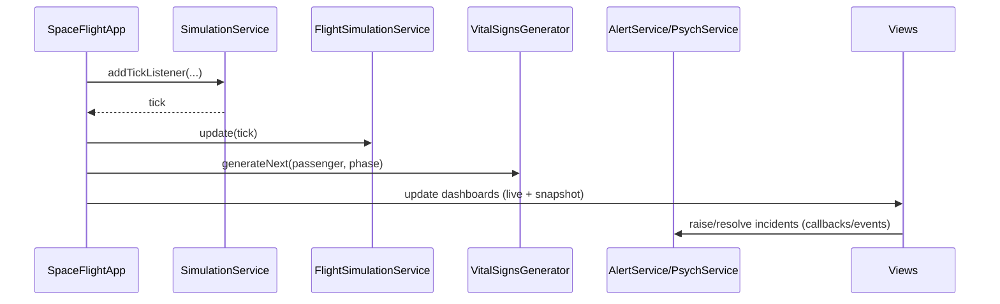

### 6.6 Why this structure matters

- **Separation of concerns:** UI remains presentation-focused.
- **Testability:** interfaces allow mock/stub implementations.

## 7. Simulation Engine

Package: `org.example.spaceflight.simulation`

### 7.1 Overview

The simulation subsystem drives **time progression**, **shuttle telemetry**, **per-passenger vital signs**, and **experience mode changes**:

| Concern | Interface | Default implementation | Primary consumer |
|---|---|---|---|
| Tick loop (wall-clock) | `SimulationService` | `DefaultSimulationService` | `SimulationConfigView`, `SpaceFlightApp` |
| Shuttle flight physics / phases | `FlightSimulationService` | `DefaultFlightSimulationService` | `SpaceFlightApp` |
| Vital trajectories | `VitalSignsGenerator` | `DefaultVitalSignsGenerator` | `SpaceFlightApp` |
| Passenger mode switches | `ExperienceModeService` | `DefaultExperienceModeService` | Passenger dashboard (via `AppContext`) |
| Vital targets from phase × mode | `IVitalTargetProvider` | `DefaultVitalTargetProvider` | Used internally by `DefaultVitalSignsGenerator` |

`AppContext` constructs each default implementation once and exposes it through the interface type. `SpaceFlightApp` registers **one** tick listener that advances flight state, regenerates vitals for every passenger, builds a `SimulationSnapshot`, and pushes UI updates on the JavaFX thread.

### 7.2 Class diagram

```mermaid
classDiagram
    direction TB

    namespace simulation {
        class SimulationService {
            <<interface>>
            +start(SimulationConfig)
            +pause()
            +resume()
            +stop()
            +setSpeed(double)
            +addTickListener(TickListener)
        }

        class DefaultSimulationService {
        }

        class FlightSimulationService {
            <<interface>>
            +update(long tickCount)
            +emergencyLanding()
            +isEmergencyLanding()
            +getCurrentState()
            +setOnEmergencyLanded(Runnable)
            +getEmergencyProgress()
        }

        class DefaultFlightSimulationService {
        }

        class VitalSignsGenerator {
            <<interface>>
            +generateNext(Passenger, FlightPhase)
            +configure(int tickIntervalMs)
            +markAsEmergency(String name, long totalTicks)
        }

        class DefaultVitalSignsGenerator {
        }

        class ExperienceModeService {
            <<interface>>
            +changeMode(Passenger, ExperienceMode)
        }

        class DefaultExperienceModeService {
        }

        class IVitalTargetProvider {
            <<interface>>
            +buildTarget(...)
        }

        class DefaultVitalTargetProvider {
        }

        class PersonalProfile {
            <<package-private>>
        }

        class PhaseTarget {
            <<package-private>>
        }
    }

    namespace model {
        class SimulationConfig
        class Passenger
        class ShuttleState
        class FlightPhase
        class ExperienceMode
        class VitalSigns
    }

    namespace app {
        class AppContext
        class SpaceFlightApp
    }

    namespace ui_simulation {
        class SimulationConfigView
    }

    DefaultSimulationService ..|> SimulationService
    DefaultFlightSimulationService ..|> FlightSimulationService
    DefaultVitalSignsGenerator ..|> VitalSignsGenerator
    DefaultExperienceModeService ..|> ExperienceModeService
    DefaultVitalTargetProvider ..|> IVitalTargetProvider

    DefaultVitalSignsGenerator --> IVitalTargetProvider : uses
    DefaultVitalSignsGenerator ..> PersonalProfile : maintains
    DefaultVitalSignsGenerator ..> PhaseTarget : receives from provider
    DefaultVitalTargetProvider ..> PersonalProfile : reads baselines
    DefaultVitalTargetProvider ..> PhaseTarget : builds

    DefaultFlightSimulationService --> ShuttleState : owns

    AppContext ..> SimulationService : creates default
    AppContext ..> FlightSimulationService : creates default
    AppContext ..> VitalSignsGenerator : creates default
    AppContext ..> ExperienceModeService : creates default

    SimulationConfigView --> SimulationService : controls
    SpaceFlightApp --> SimulationService : tick orchestration
    SpaceFlightApp --> FlightSimulationService : flight + emergency
    SpaceFlightApp --> VitalSignsGenerator : vitals per tick
    SpaceFlightApp ..> SimulationConfig : reads interval / emergencies

    VitalSignsGenerator ..> Passenger : reads / writes vitals
    VitalSignsGenerator ..> FlightPhase : input
    ExperienceModeService ..> Passenger : updates mode
```

**Dependency rules**

- **simulation → model:** services read/write `Passenger`, `ShuttleState`, `SimulationConfig`, enums, and `VitalSigns`. The model package does not depend on simulation.
- **app → simulation:** `AppContext` is the only composition root that instantiates `Default*` simulation classes; the rest of the app depends on interfaces.
- **ui.simulation → simulation:** `SimulationConfigView` depends only on `SimulationService` for start/pause/resume/stop/speed.

### 7.3 Simulation control lifecycle

The operator uses `SimulationConfigView` to start and steer the JavaFX `Timeline` inside `DefaultSimulationService`.

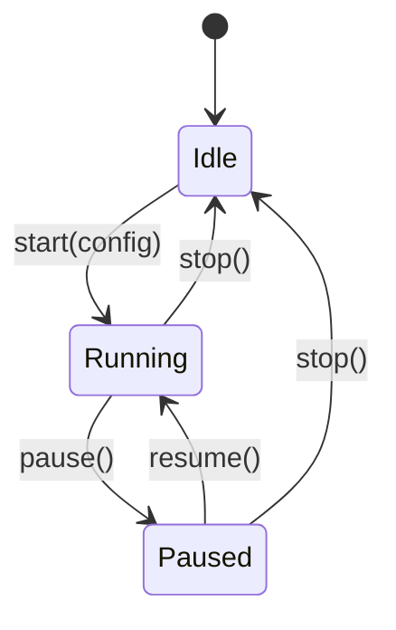

While **Running**, the operator can press **1× / 2× / 3× / 5×** speed buttons; these call `setSpeed(multiplier)`, which rebuilds the `Timeline` with a shorter key-frame interval (minimum 50 ms). Button enable/disable state is tracked locally in the view; it does **not** poll `SimulationService` accessor methods.

### 7.4 Runtime contracts

**Pre-flight configuration (`SimulationConfigView`)**

When **Start** is pressed, a `SimulationConfig` is built with:

- `emergencyPassengerCount` from the spinner (how many passengers receive a delayed vital emergency),
- `departureTime = LocalTime.now()`,
- `arrivalTime = departure + 10 minutes`,
- tick interval taken from `SimulationConfig` defaults (`500 ms` unless changed in code).

The main dashboard window opens from the start callback; the simulation timer may already be running depending on user flow.

**Tick listener (`SpaceFlightApp.openDashboard`)**

Before the first tick:

1. `VitalSignsGenerator.configure(tickIntervalMs)` — scales generator steps to the configured interval.
2. `markAsEmergency(...)` is called for the configured number of passengers (random tick between 20% and 70% of total ticks).
3. `FlightSimulationService.setOnEmergencyLanded(...)` registers stopping the tick loop when an emergency descent completes.

**Each tick (same listener)**

1. `FlightSimulationService.update(tickCount)` advances `ShuttleState` (phase, altitude, fuel, etc.).
2. For each passenger: `VitalSignsGenerator.generateNext(passenger, phase)` updates `Passenger.vitalSigns`.
3. A `SimulationSnapshot` is built for client-facing views; `Platform.runLater` updates base station, AI health, stewardess, and passenger windows.

### 7.5 Main tick pipeline

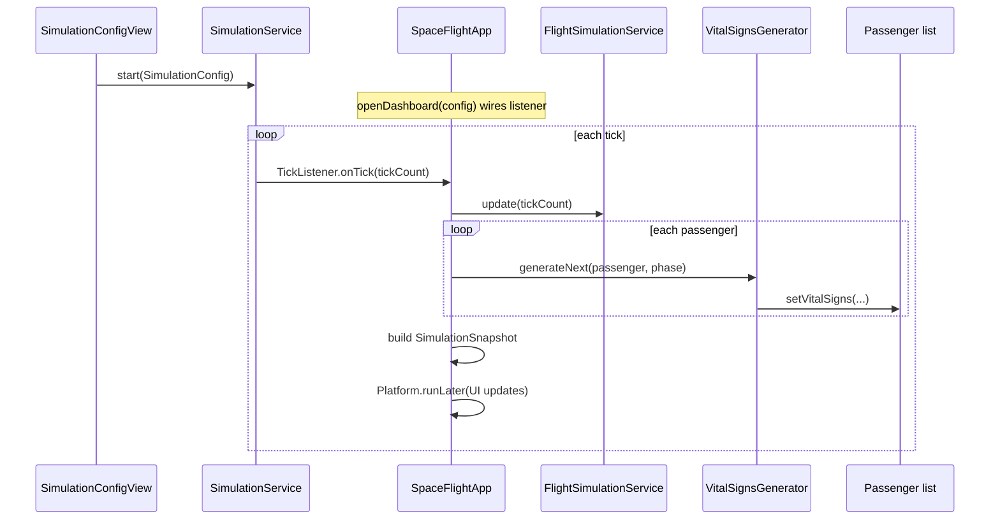

Health classification for the AI dashboard uses the **health** package and is orchestrated separately inside `AiHealthDashboardView`; it is not part of the simulation package but consumes the same passenger vitals written in this pipeline.

### 7.6 Emergency landing

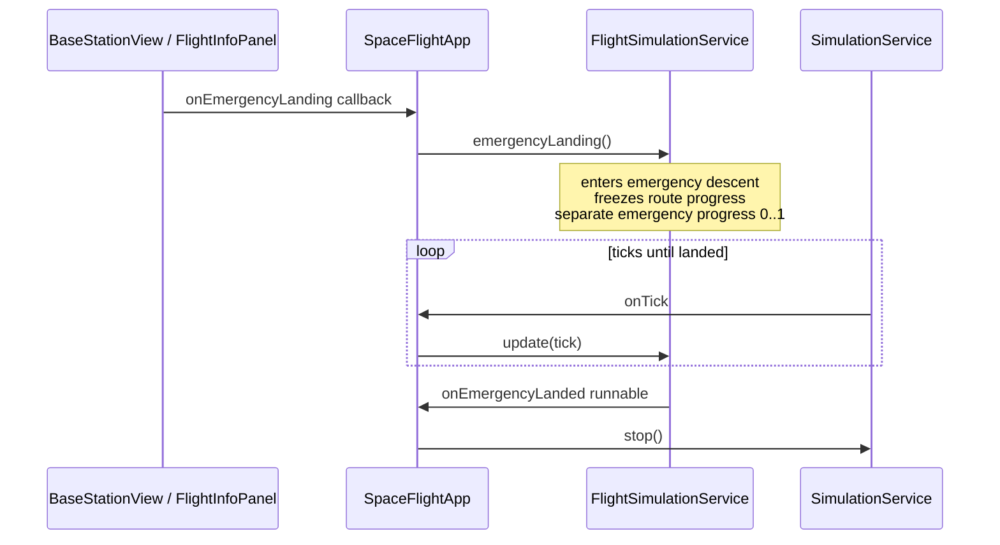

Behavior summary:

- Triggered only from the base station UI (wired in `SpaceFlightApp`).
- `DefaultFlightSimulationService` switches to an internal emergency descent path; **route progress** on `ShuttleState` stays fixed while **`getEmergencyProgress()`** drives map/UI animation.
- When descent completes, the registered `Runnable` runs and stops the `SimulationService` timeline.

### 7.7 Flight profile

`DefaultFlightSimulationService` uses the following standard (non-emergency) timeline:

| Segment | Ticks | Role |
|---|---:|---|
| Ascent | 180 | Climb to orbit |
| Orbit | 840 | Cruise |
| Descent | 180 | Return |

Default timing uses **1200** ticks at **500 ms** → **10 minutes** real time. Telemetry updated each tick includes altitude, velocity, fuel, oxygen, cabin temperature, distance, route progress, flight phase, and elapsed seconds.

### 7.8 Vital generation

`DefaultVitalSignsGenerator` assigns each passenger:

- a **stable personal baseline** (`PersonalProfile`, derived once from passenger data),
- **slow trends** so curves look physiological rather than noisy,
- **targets** from `DefaultVitalTargetProvider` combining `FlightPhase`, `ExperienceMode`, and optional emergency override,
- **hard clamps** on medically plausible ranges.

Emergency passengers (configured before launch) deteriorate toward critical targets after a **random activation tick** between 20% and 70% of the computed total flight ticks.

### 7.9 Experience mode

Passenger dashboards call `DefaultExperienceModeService` via `ExperienceModeService.changeMode(passenger, newMode)` when the user selects another mode. The service updates the `Passenger` domain object and logs the change; vital targets on subsequent ticks follow the new mode via `DefaultVitalTargetProvider`.

---

## 8. AI Health Classification

The AI Health subsystem classifies each passenger into `GREEN`, `YELLOW`, or `RED` on every simulation tick and provides both:
- an **overall health status** (for prioritization), and
- **per-vital statuses** (for detailed visualization in the AI dashboard cards).

### 8.1 Scope and runtime role

- Package: `org.example.spaceflight.health`
- Input: current `VitalSigns`, `Passenger` demographics, `FlightPhase`
- Output: immutable `HealthEvaluationResult` with overall + per-vital status
- Main consumer: `AiHealthDashboardView` (via orchestrator)
- Current active classifier: **`KnnHealthEvaluationService`**

### 8.2 Class inventory (health package)

| Class / Interface | Type | Purpose
|---|---|---|
| `HealthEvaluationService` | Interface | Contract to classify one passenger
| `KnnHealthEvaluationService` | Class | Active kNN-based classifier with safety logic
| `IHealthEvaluationOrchestrator` | Interface | Batch evaluation + result lookup contract
| `HealthEvaluationOrchestrator` | Class | Runs evaluation for all passengers and caches latest result
| `HealthEvaluationResult` | Class | Immutable result DTO (overall + per-vital map)
| `VitalType` | Enum | Vital dimensions (`BPM`, `SPO2`, `SYSTOLIC_BP`, `DIASTOLIC_BP`, `RESP_RATE`)
| `IVitalProfileProvider` | Interface | Baseline lookup abstraction by demographics + mode
| `VitalProfileTable` | Class | In-memory baseline table for all demographic segments
| `VitalProfile` | Class | One baseline profile entry (mean, stdDev, weight)
| `ITrainingDataLoader` | Interface | Training data source abstraction
| `CsvTrainingDataLoader` | Class | Loads training cases from `/training_data.csv`
| `TrainingCase` | Class (package-private) | Parsed/normalized labeled case for kNN
| `AgeGroup` | Enum (package-private) | Age bucket mapping (`YOUNG`, `MIDDLE`, `SENIOR`)

### 8.3 Data model and training data

Training data is loaded from `src/main/resources/training_data.csv` using `CsvTrainingDataLoader`.

CSV columns:
`bpm, spo2, systolic, diastolic, respRate, ageGroup, gender, mode, label`

- Demographic segmentation: `3 age groups × 2 genders × 3 experience modes = 18` segments
- Labels: `GREEN`, `YELLOW`, `RED`
- Parsing behavior:
  - ignores comments (`#`), empty rows, and header row
  - malformed lines are skipped
  - file-missing/failure returns empty list (with logging)

### 8.4 Active classification pipeline (`KnnHealthEvaluationService`)

#### Step 1 — Feature normalization

Each vital feature is normalized to `[0,1]` using min/max from the loaded training set:

`norm = (value - min) / (max - min)` (clamped to `[0,1]`).

If `max == min`, fallback is `0.5`.

#### Step 2 — Weighted Euclidean distance

Distance to each training case:

`d = sqrt(W_BPM*Δbpm² + W_SPO2*Δspo2² + W_SYS*Δsys² + W_DIAS*Δdias² + W_RR*Δrr²)`

Feature weights:
- `SPO2 = 0.30`
- `SYSTOLIC = 0.25`
- `BPM = 0.20`
- `DIASTOLIC = 0.15`
- `RESP_RATE = 0.10`

#### Step 3 — Demographic context bonus

Distance is reduced by `0.08` for each demographic match:
- same `AgeGroup`
- same `Gender`
- same `ExperienceMode`

This biases nearest neighbors toward medically comparable cases.

#### Step 4 — kNN vote

- `k = 5`
- majority vote on nearest labels determines preliminary overall class
- ties favor more critical outcome by implementation order (`RED` over `YELLOW` over `GREEN`)

#### Step 5 — Per-vital z-score statuses

Independently from kNN vote, each vital gets a z-score status using `VitalProfileTable` baselines:

`z = |value - mean| / stdDev` (capped at `4.0`)

Phase-aware thresholds in active kNN service:
- `ASCENT/DESCENT`: yellow `1.6`, red `2.8`
- `PRE_FLIGHT`: yellow `1.3`, red `2.3`
- `ORBIT/LANDED`: yellow `1.3`, red `2.2`

#### Step 6 — Escalation rules

- If per-vital has `>= 2 RED`, overall becomes `RED`
- Else if per-vital has `1 RED` or any `YELLOW`, overall is at least `YELLOW`
- This can only escalate severity, not downgrade it

#### Step 7 — Absolute safety floors (override all)

Immediate `RED`, regardless of vote/hysteresis:
- `SpO2 < 91.5`
- `BPM > 155` or `BPM < 38`

#### Step 8 — Hysteresis stabilization

To prevent status flicker:
- status change must persist for `7` consecutive ticks before commit
- exception: `RED` can escalate immediately

Per passenger, this is tracked by an internal `StatusBuffer`.

### 8.5 Baseline profile system (`VitalProfileTable`)

`VitalProfileTable` provides demographic + mode-specific normal ranges:
- base values by age and gender
- mode adjustments:
  - `ACTION`: higher expected BPM/BP
  - `RELAXED`: lower expected BPM/BP
  - `NORMAL`: baseline

It builds profiles for all 18 segments at startup and provides fallback profile:
`MIDDLE + MALE + NORMAL` if key lookup fails.

### 8.6 Batch orchestration (`HealthEvaluationOrchestrator`)

`HealthEvaluationOrchestrator` applies classification to the full passenger list each tick:

- skips passengers with `manualOverride = true`
- skips passengers without current vitals
- updates `Passenger.healthStatus`
- caches latest `HealthEvaluationResult` per passenger
- provides `getLatestResult(...)` for UI (default `allGreen()` before first evaluation)

### 8.7 Runtime flow (health subsystem)

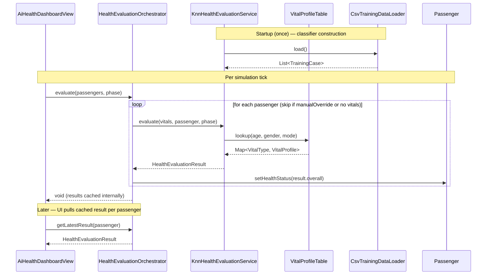


### 8.8 Behavioral notes and limitations

- If training data is unavailable, classifier returns `allGreen()` defaults.
- `TrainingCase` and `AgeGroup` are package-private by design (internal health implementation details).
- `HealthEvaluationResult.getVitalStatuses()` is available but most UI calls access per-vital values via `getVitalStatus(...)`.

---

## 9. Alert and Psychological Support System

### 9.1 Overview

There are currently two types of alerts in the program:
1. User-triggered Emergency Alert
2. Psychological Support Alert

Psychological support is only available to passengers in RELAXED experience mode. If the passenger switches to NORMAL or ACTION mode, the psychological help button becomes inactive. Note: This constraint is enforced in the UI/presenter layer; the service API itself does not validate experience mode.

### 9.2 Class Diagram

```mermaid
classDiagram
    direction TB
    %% ─────────────────── model ───────────────────

    namespace model {
        class Passenger {
            +String name
            +int age
            +Gender gender
            +String role
            +ExperienceMode experienceMode
            +VitalSigns vitalSigns
            +HealthStatus healthStatus
            +boolean manualOverride
            +isCrewMember() boolean
        }
    }

    %% ─────────────────── alert ───────────────────

    namespace alert {
        class PsychSeverity {
            <<enumeration>>
            LOW
            MEDIUM
            HIGH
        }

        class Incident {
            <<interface>>
            +getId() String
            +getPassenger() Passenger
            +getReason() String
            +getFormattedTime() String
            +isResolved() boolean
            +setResolved(boolean)
            +getStewardessNote() String
            +setStewardessNote(String)
        }

        class AlertIncident {
            +String id
            +String reason
            +LocalDateTime timestamp
            +boolean resolved
            +String stewardessNote
        }

        class PsychologicalIncident {
            +String id
            +String reason
            +PsychSeverity severity
            +LocalDateTime timestamp
            +boolean resolved
            +String stewardessNote
        }

        class AlertService {
            <<interface>>
            +raiseAlert(passenger, reason)
            +resolveAlert(alertId)
            +getAlertsForPassenger(p) List~AlertIncident~
            +getAllAlertsForPassenger(p) List~AlertIncident~
            +setOnAlertRaised(handler)
            +setOnAlertResolved(handler)
        }

        class DefaultAlertService {
        }

        class PsychologicalSupportService {
            <<interface>>
            +raiseRequest(passenger, severity, message)
            +resolveRequest(id)
            +setOnRequestRaised(handler)
            +setOnRequestResolved(handler)
        }

        class DefaultPsychologicalSupportService {
        }
    }

    %% ─────────────────── app ───────────────────

    namespace app {
        class AppContext {
            +getSimulationService()
            +getFlightSimulationService()
            +getVitalSignsGenerator()
            +getPassengerRegistry()
            +getAlertService()
            +getPsychService()
            +getExperienceModeService()
        }
    }

    %% ─────────────────── relations ───────────────────

    DefaultAlertService ..|> AlertService
    DefaultPsychologicalSupportService ..|> PsychologicalSupportService
    AlertIncident ..|> Incident
    PsychologicalIncident ..|> Incident

    AlertIncident --> Passenger : raised for
    PsychologicalIncident --> Passenger : raised for
    PsychologicalIncident --> PsychSeverity

    AppContext ..> AlertService : creates
    AppContext ..> PsychologicalSupportService : creates
```

In general the package alerts only collaborates with model and app package:

- **alert → model:** Both `AlertIncident` and `PsychologicalIncident` hold a direct reference to a `Passenger` from the model package. This association captures *which* passenger the incident was raised for. The alert package depends on model but never the other way around.
- **app → alert:** `AppContext` acts as the composition root and is responsible for instantiating the concrete service implementations (`DefaultAlertService`, `DefaultPsychologicalSupportService`). It exposes them to the rest of the application only through the `AlertService` and `PsychologicalSupportService` interfaces which ensures that no other class knows about the concrete implementations.

The `Incident` interface defines a common contract for both alert types. `AlertIncident` and `PsychologicalIncident` implement it, sharing the same lifecycle (see below) but differing in that `PsychologicalIncident` additionally carries a `PsychSeverity` level. Each incident type has its own dedicated service interface with a matching `Default*` implementation that manages the in-memory incident list and notifies registered listeners on state changes.

### 9.3 Alert Lifecycle

Both alert types share the same lifecycle:

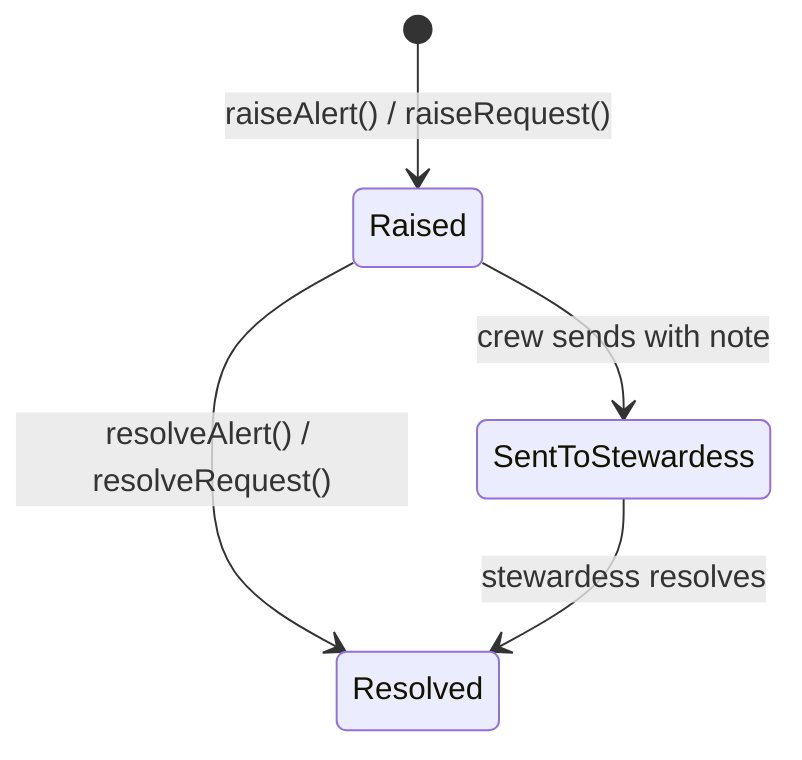
The `SentToStewardess` state is a process/UI concept. In the model, only a `resolved` flag and an optional `stewardessNote` are stored ("sent" is not represented as a separate state field).

### 9.4 Service API Semantics

**Query semantics:**
- `getAlertsForPassenger(p)` returns only unresolved (active) incidents for a passenger.
- `getAllAlertsForPassenger(p)` returns the complete history (both resolved and unresolved).

**Listener registration semantics:**
The listener registration methods (`setOnAlertRaised`, `setOnAlertResolved`, etc.) do not replace existing handlers but append to an internal list. Multiple listeners can coexist and are called synchronously in the order they were registered. No unregistration API is provided.

### 9.5 Alert Flow
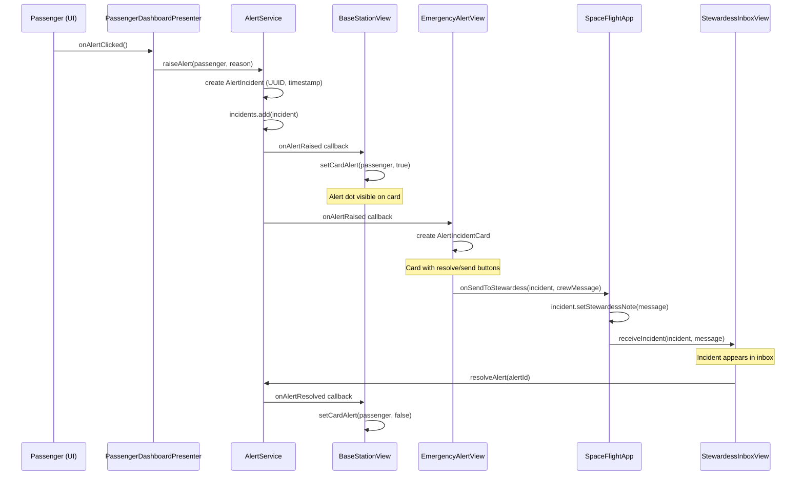

The sequence diagram above shows the complete lifecycle of a passenger-triggered alert. The flow starts at the passenger UI, passes through the `PassengerDashboardPresenter` into the `AlertService`, which stores the incident and notifies all registered listeners via callbacks. `BaseStationView` reacts by showing an alert indicator on the passenger card, while `EmergencyAlertView` creates a visual card with action buttons. When the crew decides to forward the alert, `SpaceFlightApp` acts as a mediator (via a `BiConsumer` callback), it attaches the crew note to the incident and delivers it to the `StewardessInboxView`. Finally, when the stewardess resolves the incident, the `AlertService` notifies all listeners again to clear the alert indicators.

## 10. UI Layer

The `ui` package contains the complete JavaFX presentation layer. All views are
created programmatically; the project does not use FXML files. The UI layer is
responsible for rendering simulation state, wiring user interactions to service
interfaces and keeping dashboard state synchronized with simulation ticks and
alert callbacks.

### 10.1 Package Overview

| Package | Responsibility |
|---|---|
| `ui.simulation` | Start screen, simulation configuration, start/pause/resume/stop controls and dashboard launcher |
| `ui.shared` | Reusable UI infrastructure such as the main tab container, navigation bar, color constants and route map canvas |
| `ui.basestation` | Base Station crew dashboard, flight information panel, passenger cards, detail view and incident handling pages |
| `ui.aihealth` | AI health monitor with status columns, vital trend charts and manual health overrides |
| `ui.passenger` | Passenger-facing dashboard, stewardess dashboard, settings dialog and presenter-backed interaction logic |
| `ui.passenger.theme` | Theme strategy implementations for passenger experience modes |

The UI layer depends on model objects and service interfaces (`SimulationService`,
`AlertService`, `PsychologicalSupportService`, `ExperienceModeService`,
`IHealthEvaluationOrchestrator`). It does not instantiate concrete service
implementations directly; this remains the responsibility of `AppContext` and
`SpaceFlightApp`.

### 10.2 Dashboard Entry Flow

The runtime entry point for users is `SimulationConfigView`. It collects the
number of emergency passengers, starts the simulation and exposes a person
selector for opening individual dashboards.

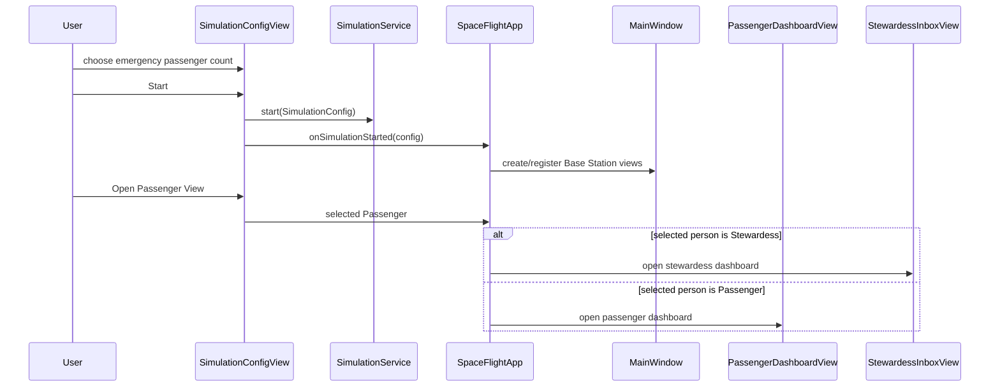

`SimulationConfigView` also controls simulation speed. The speed buttons are
disabled until the simulation is running and call `SimulationService.setSpeed(...)`
with factors `1`, `2`, `3` or `5`.

Opening a person dashboard is independent from the Base Station tab navigation.
`SpaceFlightApp.openPassengerDashboard(...)` opens a separate `Stage` for each
selected passenger. Passenger dashboards are tracked in `passengerDashboards` and
removed when their window closes. The stewardess dashboard is stored as the
single active `stewardessView`; closing the window clears that reference.

### 10.3 Shared UI Infrastructure

| Class | Role |
|---|---|
| `MainWindow` | Root `BorderPane` for the Base Station window. It owns the `NavigationBar`, registers views per tab and swaps the active center node. If no view is registered, it renders a "Coming soon" placeholder. |
| `NavigationBar` | Horizontal tab bar with five fixed tabs: `Overview`, `AI Health`, `Emergency Alert`, `Psychological Support`, `User / Settings`. Each tab emits a `NavigationBar.Tab` callback. |
| `RouteMapCanvas` | Canvas-based route visualization reused by Base Station, passenger and stewardess dashboards. It renders regular route progress and emergency-landing progress. |
| `UIColors` | Centralized color constants for health and UI status colors. |

Navigation is intentionally simple: tab selection does not recreate views. The
already constructed view node is retrieved from `MainWindow.views` and placed in
the center of the root layout. This keeps incident cards, chart history and other
view-local state alive while users switch tabs.

#### 10.3.1 Route map rendering

`RouteMapCanvas` draws a reusable Canvas scene instead of using static images for
the shuttle route. It loads `earth.jpg` from the application resources, renders a
black space background, deterministic star positions, a dashed waypoint route and
a shuttle marker interpolated along the route.

Emergency landing rendering is stateful. When emergency landing first becomes
active, the canvas latches the current shuttle position and calculates the
nearest point on the Earth surface. Later updates draw a red Bezier re-entry path
from that latched position to the target point. Once emergency progress reaches
`1.0`, the canvas keeps the shuttle fixed at the landing point.

### 10.4 Base Station Views

The Base Station is the operator-facing dashboard. `BaseStationView` composes
`FlightInfoPanel` and `PassengerOverviewPanel` and connects passenger cards to
alert and psychological-support listener callbacks.

| Class | Type | Responsibility |
|---|---|---|
| `BaseStationView` | Composite view | Main overview layout. Updates flight telemetry, passenger status indicators and opens `PassengerDetailView` through `MainWindow.setCenter(...)`. |
| `FlightInfoPanel` | Component | Displays route map, planned/elapsed/remaining time, fuel, distance, phase, altitude, velocity and the emergency-landing action. |
| `PassengerOverviewPanel` | Component | Two-column grid containing one `PassengerCardView` per registered person. |
| `PassengerCardView` | Component | Compact person card with name, role, health indicator, alert/psych visual state and an `Info` action. |
| `PassengerDetailView` | Detail view | Shows person metadata, vital signs, experience mode and alert history. |
| `EmergencyAlertView` | Incident page | Displays active medical alerts and removes cards when alerts are resolved. |
| `AlertIncidentCard` | Incident component | Contains alert reason, note field, `Send to Stewardess` and `Solved` actions. |
| `PsychologicalSupportView` | Incident page | Displays psychological support requests sorted by severity (`HIGH`, `MEDIUM`, `LOW`). |
| `PsychIncidentCard` | Incident component | Contains request message, severity, note field, `Send to Stewardess` and `Solved` actions. |

#### 10.4.1 Overview update behavior

`BaseStationView.updateFlightInfo(...)` delegates telemetry rendering to
`FlightInfoPanel.update(...)`. `BaseStationView.updatePassengerCards(...)`
updates the health indicator of each passenger card from the current passenger
list.

Medical alert and psychological support states are event-driven:

- `AlertService.setOnAlertRaised(...)` marks the corresponding passenger card as
  alert-active.
- `AlertService.setOnAlertResolved(...)` clears the alert-active state.
- `PsychologicalSupportService.setOnRequestRaised(...)` marks the corresponding
  passenger card as psych-active.
- `PsychologicalSupportService.setOnRequestResolved(...)` clears the psych state
  only if no unresolved medical alert remains for that passenger.

All listener-triggered UI mutations are wrapped in `Platform.runLater(...)` so
that JavaFX nodes are updated on the JavaFX Application Thread.

#### 10.4.2 Detail view behavior

Clicking `Info` on a `PassengerCardView` creates a `PassengerDetailView` and
replaces the main center node with that detail view. Returning to the overview
sets the center node back to `BaseStationView.root`. The detail view is refreshed
through `BaseStationView.updateDetailView()` while it is active.

#### 10.4.3 Incident forwarding

`EmergencyAlertView` and `PsychologicalSupportView` do not directly know the
stewardess dashboard. Instead, both expose a `setOnSendToStewardess(...)`
callback. `SpaceFlightApp` wires this callback and delivers the incident to
`StewardessInboxView` if a stewardess dashboard is currently open.

The card-level send actions require crew notes. Resolving an incident calls the
corresponding service (`AlertService.resolveAlert(...)` or
`PsychologicalSupportService.resolveRequest(...)`), which then notifies all
registered listeners.

The alert and psychological-support services maintain listener lists, so
`BaseStationView`, `EmergencyAlertView`, `PsychologicalSupportView` and
`StewardessInboxView` can subscribe to the same incident lifecycle without
overwriting each other.

### 10.5 AI Health Dashboard Layout

`AiHealthDashboardView` presents live health classification results in three
status columns:

1. `CRITICAL` for `HealthStatus.RED`
2. `WARNING` for `HealthStatus.YELLOW`
3. `STABLE` for `HealthStatus.GREEN`

The dashboard owns one `AiHealthPassengerCard` per passenger and keeps capped
history buffers for each vital sign. The history length is limited to 60 values
per vital type.

| Class | Responsibility |
|---|---|
| `AiHealthDashboardView` | Maintains passenger cards, vital histories, health-status ordering and column rendering. Calls the health orchestrator once per update tick. |
| `AiHealthPassengerCard` | Displays one passenger's name, experience mode, overall status badge, four vital value labels, four mini charts and manual override buttons. |
| `VitalSignsChartCanvas` | Canvas line chart for a single vital history. It colors the chart based on the per-vital health status. |

Update flow:

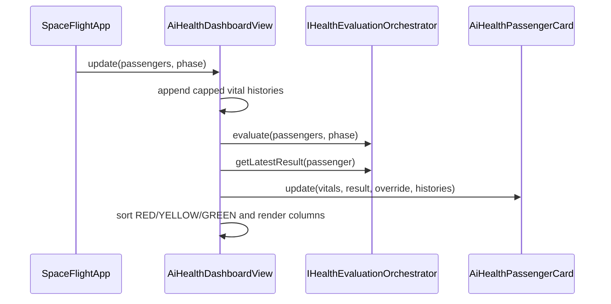

Manual override is implemented at card level through a callback into
`AiHealthDashboardView`. Pressing `G`, `Y` or `R` sets
`Passenger.healthStatus`, enables `Passenger.manualOverride` and refreshes the
columns immediately. The health orchestrator later skips passengers with manual
override enabled.

### 10.6 Passenger Dashboard and MVP Split

The passenger dashboard uses a partial MVP structure:

| Class | Responsibility |
|---|---|
| `PassengerDashboardView` | Builds JavaFX layout, owns controls, opens dialogs and forwards user actions to the presenter. |
| `PassengerDashboardPresenter` | Owns domain-facing logic: mode changes, alert creation, psych-support creation, theme application, language updates and telemetry formatting. |
| `PassengerSettingsDialog` | Non-blocking settings dialog for volume mock value, brightness/opacity and language selection. |
| `DashboardSkin` | Data holder containing references to all style-affected dashboard nodes. |

`PassengerDashboardView.update(SimulationSnapshot)` consumes the snapshot
boundary. It updates the shared route map and delegates shuttle-state
formatting to the presenter.

The presenter caches the latest raw telemetry values. This allows language and
experience-mode changes to immediately re-render label prefixes and telemetry
wording even when no new simulation tick has arrived yet.

Passenger actions:

- `Alert` calls `PassengerDashboardPresenter.onAlertClicked()`, which raises a
  medical alert through `AlertService`.
- Experience-mode radio buttons call `onModeSelected(...)`, which delegates to
  `ExperienceModeService`, reapplies the theme and updates psych-help
  visibility.
- `Psychological Help` is only visible in `RELAXED` mode. The dialog maps
  `Calm`, `Tense` and `Panic` to `LOW`, `MEDIUM` and `HIGH` severity and sends
  the request through `PsychologicalSupportService`.
- The settings gear opens `PassengerSettingsDialog`; language changes trigger
  `presenter.applyLanguage()`.

### 10.7 Passenger Theme System

The theme system is implemented with a small strategy pattern.

| Class | Role |
|---|---|
| `PassengerDashboardTheme` | Interface for applying a visual theme to a dashboard skin. |
| `ThemeFactory` | Maps `ExperienceMode` to a concrete theme. |
| `RelaxedTheme` | Soft, calm styling for `RELAXED` mode. |
| `NormalTheme` | Neutral styling for `NORMAL` mode. |
| `ActionTheme` | Darker, higher-contrast styling for `ACTION` mode. |
| `DashboardSkin` | Bundle of UI node references that a theme is allowed to style. |

`PassengerDashboardPresenter.applyTheme()` gets the current
`Passenger.experienceMode`, asks `ThemeFactory.forMode(mode)` for a theme and
applies it to the dashboard skin. The presenter also changes the root background
through a separate callback because the root `BorderPane` is not part of
`DashboardSkin`.

This keeps mode-specific styling outside of `PassengerDashboardView`, while the
view remains responsible for layout construction.

### 10.8 Stewardess Dashboard

`StewardessInboxView` is the crew member's in-flight dashboard. It intentionally
separates general notifications from actionable incident cards.

| Area | Purpose |
|---|---|
| Route and flight status | Shows route progress, phase, elapsed/remaining time and altitude. |
| Telemetry bar | Shows oxygen level, altitude, velocity and cabin temperature. |
| Active Incidents | Contains full incident cards that were explicitly forwarded from the Base Station. |
| Notifications | Contains general events such as passenger alerts and emergency-landing messages. |

Forwarded incidents are received through:

- `receiveIncident(AlertIncident, String)` for medical alerts
- `receivePsychIncident(PsychologicalIncident, String)` for psychological
  support requests

Both methods create a `StewardessIncidentCard`. Solving a card resolves the
underlying service incident and removes the card from the dashboard. Each card
also displays the crew note sent by the Base Station and the passenger vital
signs available at the time the card is created.

The stewardess can also trigger a manual alert through the sidebar alert button.
This creates an `AlertIncident` with reason `Manual alert by stewardess`.
Passenger alerts that are not explicitly forwarded still appear in the
stewardess notification list while the stewardess dashboard is open, but they do
not create actionable incident cards.

### 10.9 Simulation Control View

`SimulationConfigView` is part of the UI layer although it is shown before the
Base Station window. It creates a `SimulationConfig` with:

- configured emergency passenger count
- departure time set to the current local time
- arrival time set to departure plus ten minutes

It calls `SimulationService.start(config)`, `pause()`, `resume()`, `stop()` and
`setSpeed(...)` directly through the `SimulationService` interface. It also owns
the passenger selector that delegates dashboard creation back to the application
through `setOnOpenPassengerView(...)`.

### 10.10 Threading and State Synchronization

The UI receives state through two mechanisms:

1. Tick-based updates from the simulation loop.
2. Event callbacks from alert and psychological support services.

Views that mutate JavaFX nodes from callbacks use `Platform.runLater(...)`.
Passenger and stewardess dashboards consume `SimulationSnapshot`, while Base
Station views still use live `Passenger` and `ShuttleState` objects. This split
is intentional: the client-facing dashboards already use the future network
boundary, while the local Base Station still benefits from direct object access
for detailed status and history views.

The simulation tick listener in `SpaceFlightApp` updates flight state first,
generates new vital signs for each registered person and then builds one
`SimulationSnapshot`. Inside `Platform.runLater(...)`, the Base Station, AI
Health view, stewardess dashboard and all open passenger dashboards are refreshed
from that same tick state.

### 10.11 Current UI Limitations

- `User / Settings` in the Base Station navigation is currently a placeholder.
- Passenger volume is stored in the settings dialog but has no audio backend.
- Passenger language switching only covers labels that have explicit
  translations in `PassengerDashboardPresenter` and the dialog code.
- AI Health manual overrides cannot be cleared through the UI once enabled.
- Forwarded incidents are not queued if the stewardess dashboard is closed at
  send time.
- Most styling is inline JavaFX CSS, not external stylesheet-based styling.

---


## 11. Build and Run
#### Prerequisites

- Java 25 (JDK)
- Maven 3.x (or use the included `mvnw` wrapper)

#### Commands

```bash
# Compile
mvn clean compile

# Run the application
./mvnw javafx:run

# Run tests
mvn test

# Package
mvn package

# Run headless simulation (for tuning/evaluation)
./mvnw compile exec:java -Dexec.mainClass="org.example.spaceflight.simulation.HeadlessSimulationRunner"
```

#### Entry Point

`org.example.spaceflight.app.Launcher` → delegates to `SpaceFlightApp` (JavaFX Application).


---

## Appendix A: Logging

Every class uses the standard Java logger with a consistent declaration:

```java
private static final Logger log = Logger.getLogger(MethodHandles.lookup().lookupClass().getName());
```

Logged events include:
- Simulation start/pause/resume/stop
- Flight phase transitions
- Health severity changes (especially RED classifications)
- Safety floor triggers
- Alert creation and resolution
- Emergency landing initiation
- Experience mode changes
- Manual override actions

---

## Appendix B: Behavioral Guarantees and Limitations

- Thread-safety: Implementations are not thread-safe; they assume single-threaded JavaFX Application Thread usage.
- Persistence: In-memory only; data resets on each application run.
