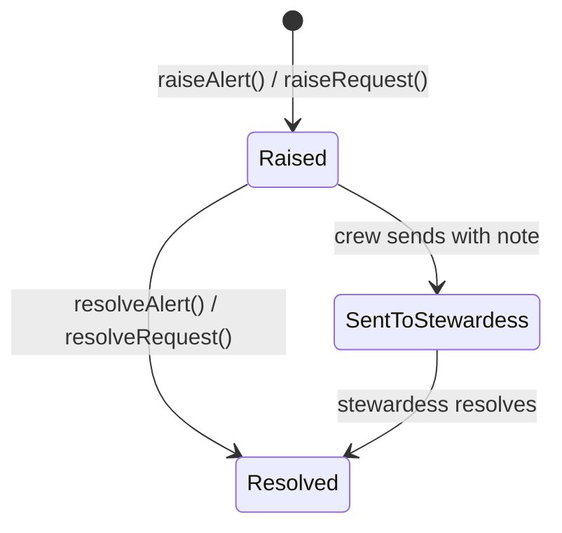
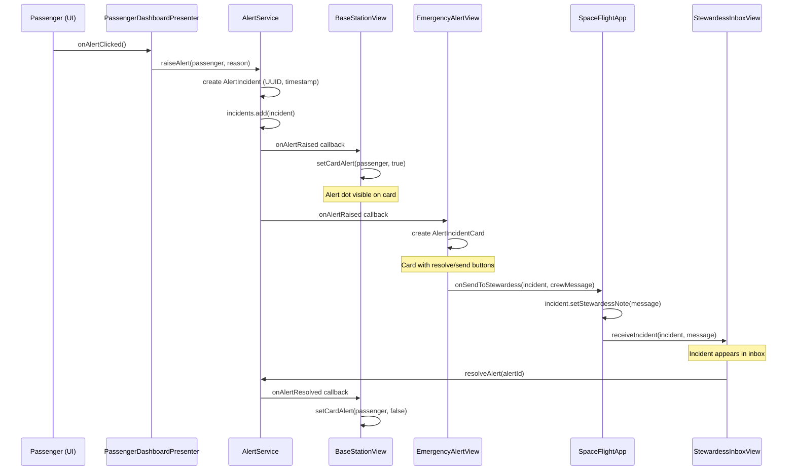

# Technical Documentation — SpaceFlight

## Table of Contents

1. [Project Overview](#1-project-overview)
2. [Technology Stack](#2-technology-stack)
3. [Architecture Overview](#3-architecture-overview) _(Package: app)_
4. [Package Structure](#4-package-structure)
5. [Domain Model](#5-domain-model) _(Package: model)_
6. [Service Layer](#6-service-layer)
7. [Simulation Engine](#7-simulation-engine) _(Package: simulation)_
8. [AI Health Classification](#8-ai-health-classification) _(Package: health)_
9. [Alert and Psychological Support System](#9-alert-and-psychological-support-system) _(Package: alert)_
   - 9.1 [Overview](#91-overview)
   - 9.2 [Class Diagram](#92-class-diagram)
   - 9.3 [Alert Lifecycle](#93-alert-lifecycle)
   - 9.4 [Service API Semantics](#94-service-api-semantics)
   - 9.5 [Alert Flow](#95-alert-flow)
10. [UI Layer](#10-ui-layer) _(Package: ui)_
11. [Build and Run](#11-build-and-run) _(Package: app)_
12. [Future Migration Path](#12-future-migration-path)
- [Appendix A: Logging](#appendix-a-logging)
- [Appendix B: Behavioral Guarantees and Limitations](#appendix-b-behavioral-guarantees-and-limitations)

---

## 1. Project Overview

SpaceFlight is a JavaFX Software prototype developed for the "Ausgewählte Themen der IT" university course by Andreas Heck und Patrick Gutgesell. It simulates the **Space Flight** phase of a space tourism company (from takeoff to shuttle landing with the goal of improving **Customer Satisfaction** by reducing passengers' mental and physical stress during the flight.

### Business Problem

Passengers experience high mental and physical load during space flight, which directly impacts customer satisfaction, perceived safety and brand loyalty.

### Core Capability

The software provides **AI-driven health monitoring and passenger prioritization** based on simulated live vital-sign data. A rule-based k-Nearest Neighbours classifier evaluates each passenger every simulation tick and assigns a three-tier severity: GREEN (normal), YELLOW (warning), RED (critical).

### Supported Subprocesses


| Subprocess | Description |
|---|---|
| Space Flight Main Flow | Simulation of the flight from takeoff through orbit to landing |
| AI Health Monitoring | Real-time health classification and passenger prioritization |
| Emergency Alert Handling | Manual and health-triggered alert incidents with crew workflows |
| Experience Mode | Passenger-selectable flight modes with different dashboards and a psychological support in one specific mode |

### Users

| Role                  | Responsibility                                                                                     |
|-----------------------|----------------------------------------------------------------------------------------------------|
| **Base Station Crew** | Monitors the flight, passenger conditions and critical incidents from Earth                        |
| **Doctors**           | Monitors the passengers health condition, supports the Stewardess remote and handles Emergencies   |
| **Psychologist**      | Takes care of passengers with psychological problems during the flight                             |
| **Passenger**         | Experiences the flight; can trigger alerts, request help, switch experience mode                   |
| **Stewardess**        | Handles in-flight incidents and medical actions                                                    |

---

## 2. Technology Stack

| Component | Technology | Version |
|---|---|---------|
| Language | Java | 25      |
| UI Framework | JavaFX | 24      |
| Build Tool | Maven | 4.0     |
| UI Construction | Programmatic (no FXML) | —       |
| Styling | Inline JavaFX CSS + Theme classes | —       |


**Dependencies:** Only `javafx-controls` (no external libraries).

---

## 3. Architecture Overview

Bitte noch ausfüllen (Klasse App): Layered Architecture, Architectural Patterns (MVP, Service Layer, Observer, Composition Root), High-Level Diagramme und Data Flow...

---

## 4. Package Structure

```
org.example.spaceflight
├── app                              Bootstrap & composition root
│   ├── Launcher                     JVM entry point
│   ├── SpaceFlightApp               JavaFX Application, lifecycle, wiring
│   └── AppContext                   Service registry (only class knowing concretions)
│
├── model                            Domain entities & value objects
│   ├── Passenger                    Passenger with health state, mode, demographics
│   ├── Stewardess                   Crew member (extends Passenger)
│   ├── VitalSigns                   5 monitored vitals snapshot
│   ├── ShuttleState                 Mutable shuttle telemetry
│   ├── SimulationSnapshot           Immutable tick data for client views
│   ├── PassengerSnapshot            Immutable per-passenger copy
│   ├── SimulationConfig             User-configured simulation parameters
│   ├── PassengerRegistry            Hardcoded passenger manifest
│   ├── IPassengerRegistry           Interface for passenger lookup
│   ├── HealthStatus                 Enum: GREEN, YELLOW, RED
│   ├── FlightPhase                  Enum: PRE_FLIGHT → ASCENT → ORBIT → DESCENT → LANDED
│   ├── ExperienceMode               Enum: RELAXED, NORMAL, ACTION (with phase factors)
│   └── Gender                       Enum: MALE, FEMALE
│
├── simulation                       Flight simulation engine
│   ├── SimulationService            Interface: tick loop control
│   ├── DefaultSimulationService     JavaFX Timeline tick engine
│   ├── FlightSimulationService      Interface: flight state progression
│   ├── DefaultFlightSimulationService Flight phases, emergency descent
│   ├── VitalSignsGenerator          Interface: vital-sign generation
│   ├── DefaultVitalSignsGenerator   Trend-based generation with personal baselines
│   ├── ExperienceModeService        Interface: mode change commands
│   ├── DefaultExperienceModeService Mode changes with logging
│   ├── IVitalTargetProvider         Interface: phase/mode target computation
│   ├── DefaultVitalTargetProvider   Applies phase × mode factors to baselines
│   ├── PersonalProfile              Per-passenger vital baseline (from name hash)
│   ├── PhaseTarget                  Target center & range for vital generation
│   ├── SimulationObserver           Records tick data for statistical evaluation
│   └── HeadlessSimulationRunner     Full flight without UI (tuning tool)
│
├── health                           Health evaluation & classification
│   ├── HealthEvaluationService      Interface: classify one passenger
│   ├── KnnHealthEvaluationService   k-NN classifier (active, k=5)
│   ├── WeightedZScoreEvaluationService Z-score classifier (alternative)
│   ├── DefaultHealthEvaluationService Simple thresholds (legacy)
│   ├── IHealthEvaluationOrchestrator Interface: batch evaluation
│   ├── HealthEvaluationOrchestrator Runs evaluation for all passengers each tick
│   ├── HealthEvaluationResult       Immutable: overall + per-vital statuses
│   ├── VitalType                    Enum: BPM, SPO2, SYSTOLIC_BP, DIASTOLIC_BP, RESP_RATE
│   ├── VitalProfile                 Population baseline (mean, stdDev, weight)
│   ├── VitalProfileTable            Demographic lookup (18 segments)
│   ├── IVitalProfileProvider        Interface: profile lookup
│   ├── AgeGroup                     Enum: YOUNG, MIDDLE, SENIOR
│   ├── TrainingCase                 One labelled row from CSV
│   ├── ITrainingDataLoader          Interface: load training data
│   └── CsvTrainingDataLoader        Loads 144 cases from training_data.csv
│
├── alert                            Alert & psychological support
│   ├── AlertService                 Interface: alert incident management
│   ├── DefaultAlertService          In-memory alert store with listeners
│   ├── AlertIncident                Alert model with lifecycle
│   ├── Incident                     Common interface for alert types
│   ├── PsychologicalSupportService  Interface: psych request management
│   ├── DefaultPsychologicalSupportService In-memory psych store
│   ├── PsychologicalIncident        Psych request with severity
│   └── PsychSeverity                Enum: LOW, MEDIUM, HIGH
│
└── ui                               JavaFX views
    ├── shared/                      Common components
    │   ├── MainWindow               Root container with tab switching
    │   ├── NavigationBar            5-tab top navigation
    │   ├── UIColors                 Centralized color constants
    │   └── RouteMapCanvas           Animated flight route visualization
    ├── basestation/                 Crew dashboards
    │   ├── BaseStationView          Crew control panel orchestrator
    │   ├── FlightInfoPanel          Telemetry sidebar + emergency button
    │   ├── PassengerOverviewPanel   2-column passenger card grid
    │   ├── PassengerCardView        Compact passenger card with alert dot
    │   ├── PassengerDetailView      Slide-out detail panel
    │   ├── EmergencyAlertView       Active alert incident dashboard
    │   ├── AlertIncidentCard        Alert row card
    │   ├── PsychologicalSupportView Psych support dashboard
    │   └── PsychIncidentCard        Psych row card
    ├── aihealth/                    AI Health dashboard
    │   ├── AiHealthDashboardView    3-column classification layout
    │   ├── AiHealthPassengerCard    Passenger card with 4 trend charts
    │   └── VitalSignsChartCanvas    Canvas-based vital line chart
    ├── passenger/                   Passenger dashboards
    │   ├── PassengerDashboardView   Per-passenger flight UI
    │   ├── PassengerDashboardPresenter MVP presenter (domain logic)
    │   ├── PassengerSettingsDialog   Settings modal (volume, brightness, language)
    │   ├── StewardessInboxView      Stewardess incident inbox
    │   ├── StewardessIncidentCard   Compact incident card
    │   └── theme/                   Experience mode themes
    │       ├── PassengerDashboardTheme  Interface: apply styling
    │       ├── DashboardSkin            All style-affected nodes
    │       ├── ThemeFactory             Mode → Theme lookup
    │       ├── RelaxedTheme             Soft green styling
    │       ├── NormalTheme              Neutral blue-grey styling
    │       └── ActionTheme              Dark navy + orange styling
    └── simulation/
        └── SimulationConfigView     Pre-flight configuration & control
```

**Total:** ~81 Java files across 8 packages.

---

## 5. Domain Model

Klasse Model ausfüllen!

---

## 6. Service Layer

Tim Service Layer erklären, wie App Context funktioniert (Launcher wkt eher dann bei Build and run erklären; Space Fligt app da erklären wo sie reinpasst)

## 7. Simulation Engine

Muss noch gemacht werden! Simulation Engine: Tick Loop, Flight Phases, Vital Signs Generation (inkl. Experience Mode Influence) und Simulated Values (Health Vitals & Shuttle Telemetry)...

---

## 8. AI Health Classification

Health Classification

## 9. Alert and Psychological Support System

### 9.1 Overview

There are currently two types of alerts in the program:
1. User-triggered Emergency Alert
2. Psychological Support Alert

Psychological support is only available to passengers in RELAXED experience mode. If the passenger switches to NORMAL or ACTION mode, the psychological help button becomes inactive. Note: This constraint is enforced in the UI/presenter layer; the service API itself does not validate experience mode.

### 9.2 Class Diagram


In general the package alerts only collaborates with model and app package:

- **alert → model:** Both `AlertIncident` and `PsychologicalIncident` hold a direct reference to a `Passenger` from the model package. This association captures *which* passenger the incident was raised for. The alert package depends on model but never the other way around.
- **app → alert:** `AppContext` acts as the composition root and is responsible for instantiating the concrete service implementations (`DefaultAlertService`, `DefaultPsychologicalSupportService`). It exposes them to the rest of the application only through the `AlertService` and `PsychologicalSupportService` interfaces which ensures that no other class knows about the concrete implementations.

The `Incident` interface defines a common contract for both alert types. `AlertIncident` and `PsychologicalIncident` implement it, sharing the same lifecycle (see below) but differing in that `PsychologicalIncident` additionally carries a `PsychSeverity` level. Each incident type has its own dedicated service interface with a matching `Default*` implementation that manages the in-memory incident list and notifies registered listeners on state changes.

### 9.3 Alert Lifecycle

Both alert types share the same lifecycle:


The `SentToStewardess` state is a process/UI concept. In the model, only a `resolved` flag and an optional `stewardessNote` are stored ("sent" is not represented as a separate state field).

### 9.4 Service API Semantics

**Query semantics:**
- `getAlertsForPassenger(p)` returns only unresolved (active) incidents for a passenger.
- `getAllAlertsForPassenger(p)` returns the complete history (both resolved and unresolved).

**Listener registration semantics:**
The listener registration methods (`setOnAlertRaised`, `setOnAlertResolved`, etc.) do not replace existing handlers but append to an internal list. Multiple listeners can coexist and are called synchronously in the order they were registered. No unregistration API is provided.

### 9.5 Alert Flow


The sequence diagram above shows the complete lifecycle of a passenger-triggered alert. The flow starts at the passenger UI, passes through the `PassengerDashboardPresenter` into the `AlertService`, which stores the incident and notifies all registered listeners via callbacks. `BaseStationView` reacts by showing an alert indicator on the passenger card, while `EmergencyAlertView` creates a visual card with action buttons. When the crew decides to forward the alert, `SpaceFlightApp` acts as a mediator (via a `BiConsumer` callback), it attaches the crew note to the incident and delivers it to the `StewardessInboxView`. Finally, when the stewardess resolves the incident, the `AlertService` notifies all listeners again to clear the alert indicators.

## 10. UI Layer

UI: Dashboard Overview, Navigation, Theme System, AI Health Dashboard Layout und alle View-Komponenten...

---


## 11. Build and Run

Tim mach das: Prerequisites, Build-Commands, Entry Point und Run-Konfiguration._

---

## 12. Future Migration Path

The codebase is deliberately structured so that moving from a single-process application to a client-server architecture requires **no changes to any view or business-logic class**.

### What Changes

| Current (Single-Process) | After HTTP Migration |
|---|---|
| `AppContext` creates `Default*` services | Server: same. Client: `ClientAppContext` with HTTP-backed implementations |
| `DefaultSimulationService` fires JavaFX Timeline | Server: same. Clients subscribe to WebSocket/SSE |
| Tick data passed in-memory as `SimulationSnapshot` | Server serializes to JSON; clients deserialize |
| Alert/psych listener callbacks fire in-process | Server publishes via WebSocket; clients subscribe |


---

## Appendix A: Logging

Every class uses the standard Java logger with a consistent declaration:

```java
private static final Logger log = Logger.getLogger(MethodHandles.lookup().lookupClass().getName());
```

Logged events include:
- Simulation start/pause/resume/stop
- Flight phase transitions
- Health severity changes (especially RED classifications)
- Safety floor triggers
- Alert creation and resolution
- Emergency landing initiation
- Experience mode changes
- Manual override actions

---

## Appendix B: Behavioral Guarantees and Limitations

- Thread-safety: Implementations are not thread-safe; they assume single-threaded JavaFX Application Thread usage.
- Persistence: In-memory only; data resets on each application run.
