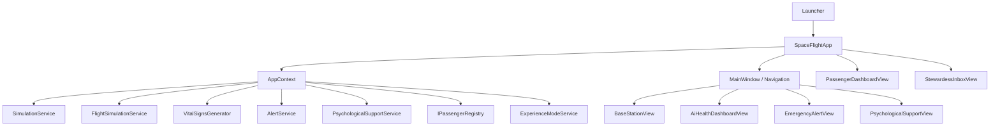
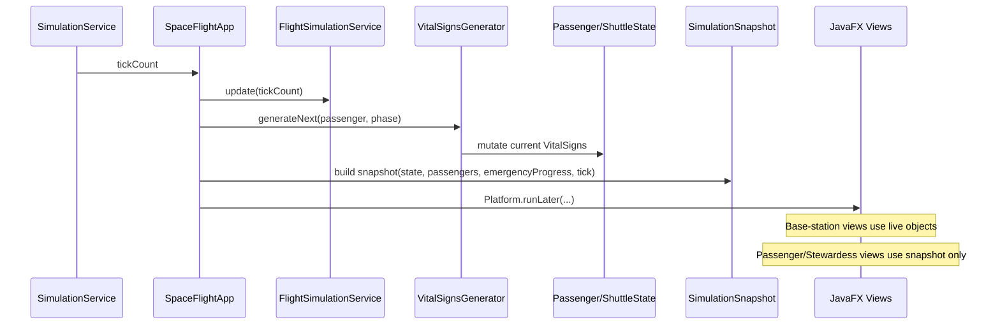
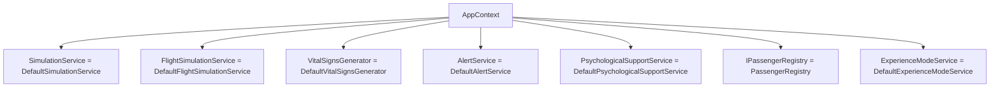
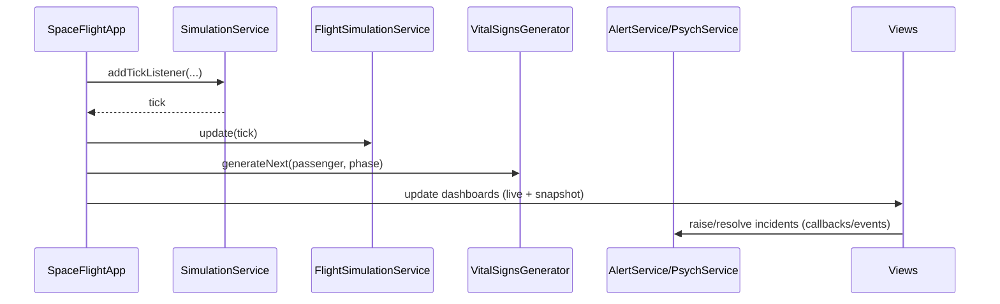
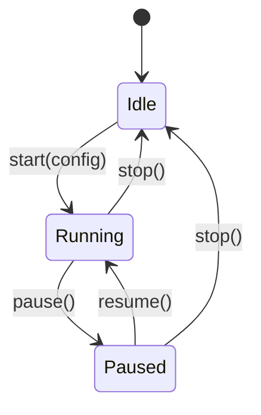
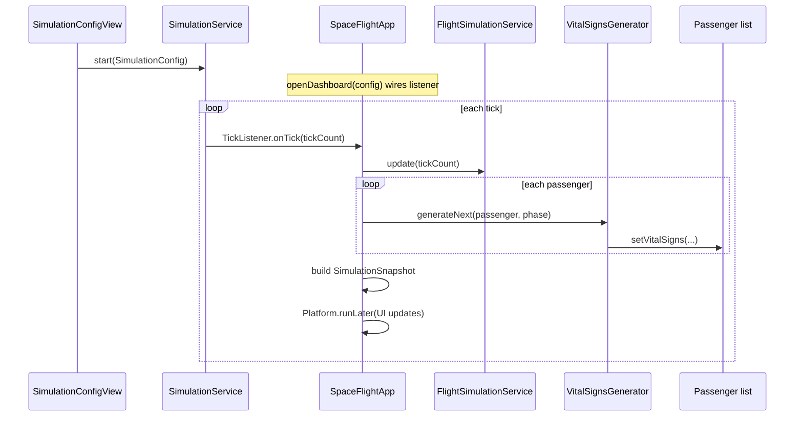
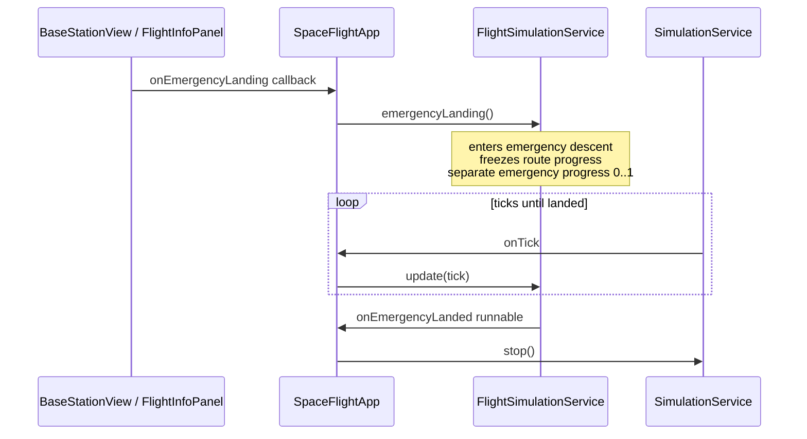
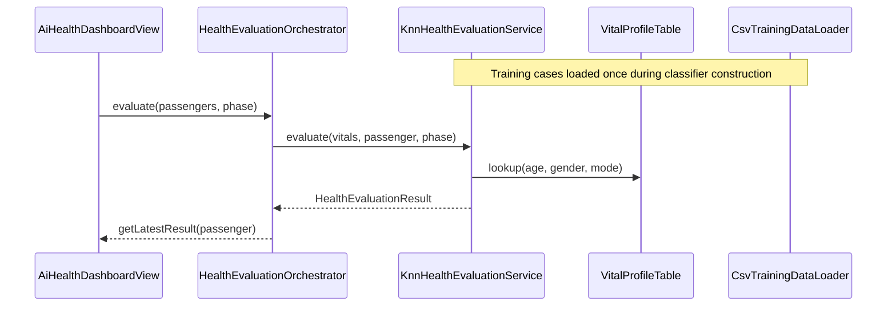
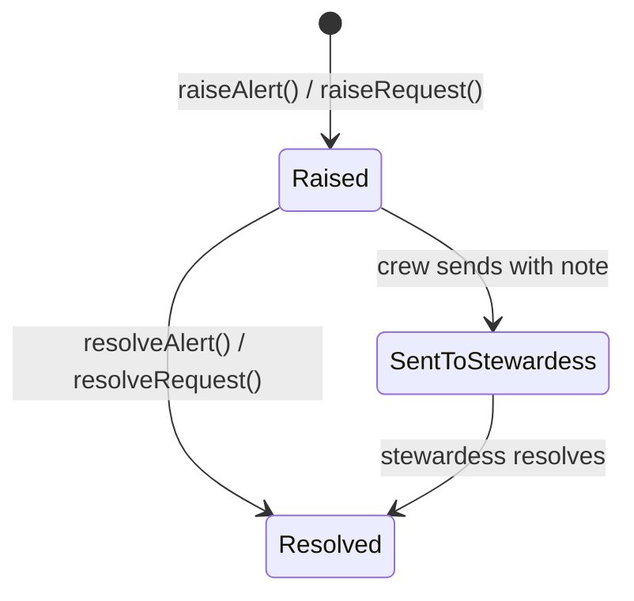
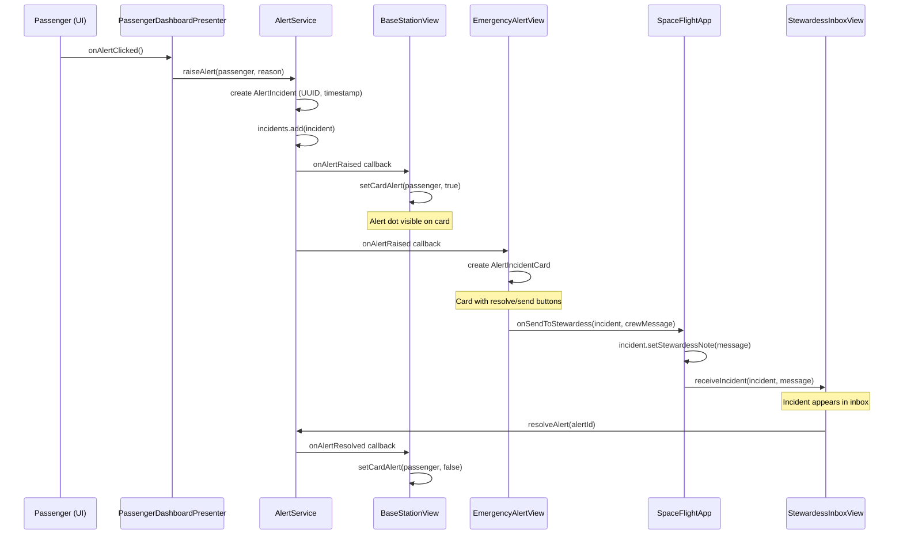

# Technical Documentation — SpaceFlight

## Table of Contents

1. [Project Overview](#1-project-overview)
2. [Technology Stack](#2-technology-stack)
3. [Architecture Overview](#3-architecture-overview) _(Package: app)_
4. [Package Structure](#4-package-structure)
5. [Domain Model](#5-domain-model) _(Package: model)_
6. [Service Layer](#6-service-layer)
7. [Simulation Engine](#7-simulation-engine) _(Package: simulation)_
   - 7.1 [Overview](#71-overview)
   - 7.2 [Class diagram](#72-class-diagram)
   - 7.3 [Simulation control lifecycle](#73-simulation-control-lifecycle)
   - 7.4 [Runtime contracts](#74-runtime-contracts)
   - 7.5 [Main tick pipeline](#75-main-tick-pipeline)
   - 7.6 [Emergency landing](#76-emergency-landing)
   - 7.7 [Flight profile](#77-flight-profile)
   - 7.8 [Vital generation](#78-vital-generation)
   - 7.9 [Experience mode](#79-experience-mode)
8. [AI Health Classification](#8-ai-health-classification) _(Package: health)_
9. [Alert and Psychological Support System](#9-alert-and-psychological-support-system) _(Package: alert)_
   - 9.1 [Overview](#91-overview)
   - 9.2 [Class Diagram](#92-class-diagram)
   - 9.3 [Alert Lifecycle](#93-alert-lifecycle)
   - 9.4 [Service API Semantics](#94-service-api-semantics)
   - 9.5 [Alert Flow](#95-alert-flow)
10. [UI Layer](#10-ui-layer) _(Package: ui)_
11. [Build and Run](#11-build-and-run) _(Package: app)_
12. [Future Outlook](#12-future-outlook)
- [Appendix A: Logging](#appendix-a-logging)
- [Appendix B: Behavioral Guarantees and Limitations](#appendix-b-behavioral-guarantees-and-limitations)

---

## 1. Project Overview

SpaceFlight is a JavaFX Software prototype developed for the "Ausgewählte Themen der IT" university course by Andreas Heck und Patrick Gutgesell. It simulates the **Space Flight** phase of a space tourism company (from takeoff to shuttle landing with the goal of improving **Customer Satisfaction** by reducing passengers' mental and physical stress during the flight.

### Business Problem

Passengers experience high mental and physical load during space flight, which directly impacts customer satisfaction, perceived safety and brand loyalty.

### Core Capability

The software provides **AI-driven health monitoring and passenger prioritization** based on simulated live vital-sign data. A rule-based k-Nearest Neighbours classifier evaluates each passenger every simulation tick and assigns a three-tier severity: GREEN (normal), YELLOW (warning), RED (critical).

### Supported Subprocesses


| Subprocess | Description |
|---|---|
| Space Flight Main Flow | Simulation of the flight from takeoff through orbit to landing |
| AI Health Monitoring | Real-time health classification and passenger prioritization |
| Emergency Alert Handling | Manual and health-triggered alert incidents with crew workflows |
| Experience Mode | Passenger-selectable flight modes with different dashboards and a psychological support in one specific mode |

### Users

| Role                  | Responsibility                                                                                     |
|-----------------------|----------------------------------------------------------------------------------------------------|
| **Base Station Crew** | Monitors the flight, passenger conditions and critical incidents from Earth                        |
| **Doctors**           | Monitors the passengers health condition, supports the Stewardess remote and handles Emergencies   |
| **Psychologist**      | Takes care of passengers with psychological problems during the flight                             |
| **Passenger**         | Experiences the flight; can trigger alerts, request help, switch experience mode                   |
| **Stewardess**        | Handles in-flight incidents and medical actions                                                    |

---

## 2. Technology Stack

| Component | Technology | Version |
|---|---|---------|
| Language | Java | 25      |
| UI Framework | JavaFX | 24      |
| Build Tool | Maven | 4.0     |
| UI Construction | Programmatic (no FXML) | —       |
| Styling | Inline JavaFX CSS + Theme classes | —       |


**Dependencies:** Only `javafx-controls` (no external libraries).

---

## 3. Architecture Overview

The application follows a **layered single-process architecture** with clear interface boundaries so core services can later be replaced by remote (client/server) implementations.

### 3.1 Layered Architecture

| Layer | Main Package(s) | Responsibility |
|---|---|---|
| Bootstrap / Composition Root | `app` (`Launcher`, `SpaceFlightApp`, `AppContext`) | Application startup, dependency wiring, lifecycle |
| Presentation | `ui.*` | JavaFX views and UI interaction logic (including MVP in passenger dashboard) |
| Service / Use-Case | `simulation`, `health`, `alert` | Flight progression, vital generation, health classification, incident workflows |
| Domain Model | `model` | Passenger, shuttle state, snapshots, enums and value objects |

`SpaceFlightApp` is the orchestration center at runtime. `AppContext` is the only class that knows concrete service implementations.

### 3.2 Architectural Patterns

#### Service Layer
- Service interfaces define use-cases (`SimulationService`, `FlightSimulationService`, `VitalSignsGenerator`, `HealthEvaluationService`, `AlertService`, `PsychologicalSupportService`).
- UI classes depend on interfaces, not concrete implementations.
- `AppContext` binds interfaces to local defaults (`Default*` classes).

#### Composition Root
- `Launcher.main()` starts JavaFX.
- `SpaceFlightApp.start()` creates and wires the application graph.
- `AppContext` is the composition root registry for concrete services.

#### Observer / Event-Driven Updates
- Tick-based updates: `SimulationService.addTickListener(...)`.
- Alert events: callback registration (e.g. alert/psych request listeners).
- JavaFX thread handoff: `Platform.runLater(...)` updates all UI views safely.

#### MVP (where used)
- Passenger dashboard follows MVP split (`PassengerDashboardView` + `PassengerDashboardPresenter`).
- Presenter contains interaction/domain logic; view focuses on rendering and event forwarding.

### 3.3 High-Level Component Diagram



### 3.4 Runtime Data Flow (per simulation tick)



### 3.5 Client/Server Readiness (already coded)

- **Interface-first design** across services enables swapping local implementations for remote adapters.
- **Snapshot boundary** already exists (`SimulationSnapshot`): client-facing views consume serializable snapshot data instead of direct object references.
- **`AppContext` swap strategy**: migration to client/server mainly requires replacing local `Default*` services with HTTP/gRPC-backed implementations while keeping most view/controller code stable.

### 3.6 Current Scope vs Future Split

- **Current:** all modules run in one JVM process (JavaFX desktop app).
- **Future-ready seams already present:** service interfaces, callback/event contracts, and snapshot-based data transport.
--- 

## 4. Package Structure

```
org.example.spaceflight
├── app                              Bootstrap & composition root
│   ├── Launcher                     JVM entry point
│   ├── SpaceFlightApp               JavaFX Application, lifecycle, wiring
│   └── AppContext                   Service registry (only class knowing concretions)
│
├── model                            Domain entities & value objects
│   ├── Passenger                    Passenger with health state, mode, demographics
│   ├── Stewardess                   Crew member (extends Passenger)
│   ├── VitalSigns                   5 monitored vitals snapshot
│   ├── ShuttleState                 Mutable shuttle telemetry
│   ├── SimulationSnapshot           Immutable tick data for client views
│   ├── PassengerSnapshot            Immutable per-passenger copy
│   ├── SimulationConfig             User-configured simulation parameters
│   ├── PassengerRegistry            Hardcoded passenger manifest
│   ├── IPassengerRegistry           Interface for passenger lookup
│   ├── HealthStatus                 Enum: GREEN, YELLOW, RED
│   ├── FlightPhase                  Enum: PRE_FLIGHT → ASCENT → ORBIT → DESCENT → LANDED
│   ├── ExperienceMode               Enum: RELAXED, NORMAL, ACTION (with phase factors)
│   └── Gender                       Enum: MALE, FEMALE
│
├── simulation                       Flight simulation engine
│   ├── SimulationService            Interface: tick loop control
│   ├── DefaultSimulationService     JavaFX Timeline tick engine
│   ├── FlightSimulationService      Interface: flight state progression
│   ├── DefaultFlightSimulationService Flight phases, emergency descent
│   ├── VitalSignsGenerator          Interface: vital-sign generation
│   ├── DefaultVitalSignsGenerator   Trend-based generation with personal baselines
│   ├── ExperienceModeService        Interface: mode change commands
│   ├── DefaultExperienceModeService Mode changes with logging
│   ├── IVitalTargetProvider         Interface: phase/mode target computation
│   ├── DefaultVitalTargetProvider   Applies phase × mode factors to baselines
│   ├── PersonalProfile              Per-passenger vital baseline (package-private helper)
│   └── PhaseTarget                  Target center & range for vital generation (package-private helper)
│
├── health                           Health evaluation & classification
│   ├── HealthEvaluationService      Interface: classify one passenger
│   ├── KnnHealthEvaluationService   k-NN classifier (active, k=5)
│   ├── WeightedZScoreEvaluationService Z-score classifier (alternative)
│   ├── DefaultHealthEvaluationService Simple thresholds (legacy)
│   ├── IHealthEvaluationOrchestrator Interface: batch evaluation
│   ├── HealthEvaluationOrchestrator Runs evaluation for all passengers each tick
│   ├── HealthEvaluationResult       Immutable: overall + per-vital statuses
│   ├── VitalType                    Enum: BPM, SPO2, SYSTOLIC_BP, DIASTOLIC_BP, RESP_RATE
│   ├── VitalProfile                 Population baseline (mean, stdDev, weight)
│   ├── VitalProfileTable            Demographic lookup (18 segments)
│   ├── IVitalProfileProvider        Interface: profile lookup
│   ├── AgeGroup                     Enum: YOUNG, MIDDLE, SENIOR
│   ├── TrainingCase                 One labelled row from CSV
│   ├── ITrainingDataLoader          Interface: load training data
│   └── CsvTrainingDataLoader        Loads 144 cases from training_data.csv
│
├── alert                            Alert & psychological support
│   ├── AlertService                 Interface: alert incident management
│   ├── DefaultAlertService          In-memory alert store with listeners
│   ├── AlertIncident                Alert model with lifecycle
│   ├── Incident                     Common interface for alert types
│   ├── PsychologicalSupportService  Interface: psych request management
│   ├── DefaultPsychologicalSupportService In-memory psych store
│   ├── PsychologicalIncident        Psych request with severity
│   └── PsychSeverity                Enum: LOW, MEDIUM, HIGH
│
└── ui                               JavaFX views
    ├── shared/                      Common components
    │   ├── MainWindow               Root container with tab switching
    │   ├── NavigationBar            5-tab top navigation
    │   ├── UIColors                 Centralized color constants
    │   └── RouteMapCanvas           Animated flight route visualization
    ├── basestation/                 Crew dashboards
    │   ├── BaseStationView          Crew control panel orchestrator
    │   ├── FlightInfoPanel          Telemetry sidebar + emergency button
    │   ├── PassengerOverviewPanel   2-column passenger card grid
    │   ├── PassengerCardView        Compact passenger card with alert dot
    │   ├── PassengerDetailView      Slide-out detail panel
    │   ├── EmergencyAlertView       Active alert incident dashboard
    │   ├── AlertIncidentCard        Alert row card
    │   ├── PsychologicalSupportView Psych support dashboard
    │   └── PsychIncidentCard        Psych row card
    ├── aihealth/                    AI Health dashboard
    │   ├── AiHealthDashboardView    3-column classification layout
    │   ├── AiHealthPassengerCard    Passenger card with 4 trend charts
    │   └── VitalSignsChartCanvas    Canvas-based vital line chart
    ├── passenger/                   Passenger dashboards
    │   ├── PassengerDashboardView   Per-passenger flight UI
    │   ├── PassengerDashboardPresenter MVP presenter (domain logic)
    │   ├── PassengerSettingsDialog   Settings modal (volume, brightness, language)
    │   ├── StewardessInboxView      Stewardess incident inbox
    │   ├── StewardessIncidentCard   Compact incident card
    │   └── theme/                   Experience mode themes
    │       ├── PassengerDashboardTheme  Interface: apply styling
    │       ├── DashboardSkin            All style-affected nodes
    │       ├── ThemeFactory             Mode → Theme lookup
    │       ├── RelaxedTheme             Soft green styling
    │       ├── NormalTheme              Neutral blue-grey styling
    │       └── ActionTheme              Dark navy + orange styling
    └── simulation/
        └── SimulationConfigView     Pre-flight configuration & control
```

**Total:** ~81 Java files across 8 packages.

---

## 5. Domain Model

Klasse Model ausfüllen!

---

## 6. Service Layer

The Service Layer encapsulates all application use-cases behind interfaces and keeps UI code independent from concrete implementations.

### 6.1 Purpose of the Service Layer

- Centralizes core behavior (simulation timing, flight state, vital generation, alerts, psych support, mode changes).
- Exposes stable contracts to the UI.
- Allows implementations to be replaced (e.g., local in-memory today, remote API later) without rewriting views.

### 6.2 Core Service Contracts and Default Implementations

| Interface | Default Implementation | Responsibility |
|---|---|---|
| `SimulationService` | `DefaultSimulationService` | Tick loop control (start/stop/listeners) |
| `FlightSimulationService` | `DefaultFlightSimulationService` | Flight phase progression and emergency landing flow |
| `VitalSignsGenerator` | `DefaultVitalSignsGenerator` | Generates next vital-sign values per passenger and phase |
| `AlertService` | `DefaultAlertService` | Emergency incident lifecycle and listeners |
| `PsychologicalSupportService` | `DefaultPsychologicalSupportService` | Psychological support requests and listeners |
| `IPassengerRegistry` | `PassengerRegistry` | Passenger lookup/list for runtime |
| `ExperienceModeService` | `DefaultExperienceModeService` | Mode changes (`RELAXED`, `NORMAL`, `ACTION`) |

### 6.3 How `AppContext` works

`AppContext` is the service registry and local composition container:

1. In its constructor, it instantiates all default concrete services exactly once.
2. It stores them as interface types.
3. It exposes typed getters used by orchestration/UI classes.

This gives a single source of wiring truth:



### 6.4 Where `SpaceFlightApp` fits

`SpaceFlightApp` sits above the Service Layer as the runtime orchestrator:

- pulls service interfaces from `AppContext`,
- wires views to those services,
- defines cross-service workflows (simulation tick pipeline, emergency landing propagation, dashboard updates),
- acts as boundary coordinator between live domain objects and `SimulationSnapshot` for client-facing views.

It does **not** implement low-level service logic itself; it coordinates existing services and UI components.

### 6.5 Runtime interaction (Service Layer in action)



### 6.6 Why this structure matters

- **Separation of concerns:** UI remains presentation-focused.
- **Testability:** interfaces allow mock/stub implementations.
- **Replaceability:** migration path to client/server mostly requires replacing `AppContext` bindings with remote-backed services.

## 7. Simulation Engine

Package: `org.example.spaceflight.simulation`

This chapter describes only the types and call paths used by the running JavaFX application (`Launcher` → `SpaceFlightApp` → `AppContext`). Optional command-line tooling exists in the source tree but is **not** covered here.

### 7.1 Overview

The simulation subsystem drives **time progression**, **shuttle telemetry**, **per-passenger vital signs**, and **experience mode changes**:

| Concern | Interface | Default implementation | Primary consumer |
|---|---|---|---|
| Tick loop (wall-clock) | `SimulationService` | `DefaultSimulationService` | `SimulationConfigView`, `SpaceFlightApp` |
| Shuttle flight physics / phases | `FlightSimulationService` | `DefaultFlightSimulationService` | `SpaceFlightApp` |
| Vital trajectories | `VitalSignsGenerator` | `DefaultVitalSignsGenerator` | `SpaceFlightApp` |
| Passenger mode switches | `ExperienceModeService` | `DefaultExperienceModeService` | Passenger dashboard (via `AppContext`) |
| Vital targets from phase × mode | `IVitalTargetProvider` | `DefaultVitalTargetProvider` | Used internally by `DefaultVitalSignsGenerator` |

`AppContext` constructs each default implementation once and exposes it through the interface type. `SpaceFlightApp` registers **one** tick listener that advances flight state, regenerates vitals for every passenger, builds a `SimulationSnapshot`, and pushes UI updates on the JavaFX thread.

### 7.2 Class diagram


**Dependency rules**

- **simulation → model:** services read/write `Passenger`, `ShuttleState`, `SimulationConfig`, enums, and `VitalSigns`. The model package does not depend on simulation.
- **app → simulation:** `AppContext` is the only composition root that instantiates `Default*` simulation classes; the rest of the app depends on interfaces.
- **ui.simulation → simulation:** `SimulationConfigView` depends only on `SimulationService` for start/pause/resume/stop/speed.

### 7.3 Simulation control lifecycle

The operator uses `SimulationConfigView` to start and steer the JavaFX `Timeline` inside `DefaultSimulationService`.



While **Running**, the operator can press **1× / 2× / 3× / 5×** speed buttons; these call `setSpeed(multiplier)`, which rebuilds the `Timeline` with a shorter key-frame interval (minimum 50 ms). Button enable/disable state is tracked locally in the view; it does **not** poll `SimulationService` accessor methods.

### 7.4 Runtime contracts

**Pre-flight configuration (`SimulationConfigView`)**

When **Start** is pressed, a `SimulationConfig` is built with:

- `emergencyPassengerCount` from the spinner (how many passengers receive a delayed vital emergency),
- `departureTime = LocalTime.now()`,
- `arrivalTime = departure + 10 minutes`,
- tick interval taken from `SimulationConfig` defaults (`500 ms` unless changed in code).

The main dashboard window opens from the start callback; the simulation timer may already be running depending on user flow.

**Tick listener (`SpaceFlightApp.openDashboard`)**

Before the first tick:

1. `VitalSignsGenerator.configure(tickIntervalMs)` — scales generator steps to the configured interval.
2. `markAsEmergency(...)` is called for the configured number of passengers (random tick between 20% and 70% of total ticks).
3. `FlightSimulationService.setOnEmergencyLanded(...)` registers stopping the tick loop when an emergency descent completes.

**Each tick (same listener)**

1. `FlightSimulationService.update(tickCount)` advances `ShuttleState` (phase, altitude, fuel, etc.).
2. For each passenger: `VitalSignsGenerator.generateNext(passenger, phase)` updates `Passenger.vitalSigns`.
3. A `SimulationSnapshot` is built for client-facing views; `Platform.runLater` updates base station, AI health, stewardess, and passenger windows.

### 7.5 Main tick pipeline



Health classification for the AI dashboard uses the **health** package and is orchestrated separately inside `AiHealthDashboardView`; it is not part of the simulation package but consumes the same passenger vitals written in this pipeline.

### 7.6 Emergency landing



Behavior summary:

- Triggered only from the base station UI (wired in `SpaceFlightApp`).
- `DefaultFlightSimulationService` switches to an internal emergency descent path; **route progress** on `ShuttleState` stays fixed while **`getEmergencyProgress()`** drives map/UI animation.
- When descent completes, the registered `Runnable` runs and stops the `SimulationService` timeline.

### 7.7 Flight profile

`DefaultFlightSimulationService` uses the following standard (non-emergency) timeline:

| Segment | Ticks | Role |
|---|---:|---|
| Ascent | 180 | Climb to orbit |
| Orbit | 840 | Cruise |
| Descent | 180 | Return |

Default timing uses **1200** ticks at **500 ms** → **10 minutes** real time. Telemetry updated each tick includes altitude, velocity, fuel, oxygen, cabin temperature, distance, route progress, flight phase, and elapsed seconds.

### 7.8 Vital generation

`DefaultVitalSignsGenerator` assigns each passenger:

- a **stable personal baseline** (`PersonalProfile`, derived once from passenger data),
- **slow trends** so curves look physiological rather than noisy,
- **targets** from `DefaultVitalTargetProvider` combining `FlightPhase`, `ExperienceMode`, and optional emergency override,
- **hard clamps** on medically plausible ranges.

Emergency passengers (configured before launch) deteriorate toward critical targets after a **random activation tick** between 20% and 70% of the computed total flight ticks.

### 7.9 Experience mode

Passenger dashboards call `DefaultExperienceModeService` via `ExperienceModeService.changeMode(passenger, newMode)` when the user selects another mode. The service updates the `Passenger` domain object and logs the change; vital targets on subsequent ticks follow the new mode via `DefaultVitalTargetProvider`.

---

## 8. AI Health Classification

The AI Health subsystem classifies each passenger into `GREEN`, `YELLOW`, or `RED` on every simulation tick and provides both:
- an **overall health status** (for prioritization), and
- **per-vital statuses** (for detailed visualization in the AI dashboard cards).

### 8.1 Scope and runtime role

- Package: `org.example.spaceflight.health`
- Input: current `VitalSigns`, `Passenger` demographics, `FlightPhase`
- Output: immutable `HealthEvaluationResult` with overall + per-vital status
- Main consumer: `AiHealthDashboardView` (via orchestrator)
- Current active classifier: **`KnnHealthEvaluationService`**

### 8.2 Class inventory (health package)

| Class / Interface | Type | Purpose | Currently used |
|---|---|---|---|
| `HealthEvaluationService` | Interface | Contract to classify one passenger | Yes |
| `KnnHealthEvaluationService` | Class | Active kNN-based classifier with safety logic | Yes |
| `WeightedZScoreEvaluationService` | Class | Alternative weighted z-score classifier | No (not wired) |
| `IHealthEvaluationOrchestrator` | Interface | Batch evaluation + result lookup contract | Yes |
| `HealthEvaluationOrchestrator` | Class | Runs evaluation for all passengers and caches latest result | Yes |
| `HealthEvaluationResult` | Class | Immutable result DTO (overall + per-vital map) | Yes |
| `VitalType` | Enum | Vital dimensions (`BPM`, `SPO2`, `SYSTOLIC_BP`, `DIASTOLIC_BP`, `RESP_RATE`) | Yes |
| `IVitalProfileProvider` | Interface | Baseline lookup abstraction by demographics + mode | Yes |
| `VitalProfileTable` | Class | In-memory baseline table for all demographic segments | Yes |
| `VitalProfile` | Class | One baseline profile entry (mean, stdDev, weight) | Yes |
| `ITrainingDataLoader` | Interface | Training data source abstraction | Yes |
| `CsvTrainingDataLoader` | Class | Loads training cases from `/training_data.csv` | Yes |
| `TrainingCase` | Class (package-private) | Parsed/normalized labeled case for kNN | Yes (internal) |
| `AgeGroup` | Enum (package-private) | Age bucket mapping (`YOUNG`, `MIDDLE`, `SENIOR`) | Yes (internal) |

### 8.3 Data model and training data

Training data is loaded from `src/main/resources/training_data.csv` using `CsvTrainingDataLoader`.

CSV columns:
`bpm, spo2, systolic, diastolic, respRate, ageGroup, gender, mode, label`

- Demographic segmentation: `3 age groups × 2 genders × 3 experience modes = 18` segments
- Labels: `GREEN`, `YELLOW`, `RED`
- Parsing behavior:
  - ignores comments (`#`), empty rows, and header row
  - malformed lines are skipped
  - file-missing/failure returns empty list (with logging)

### 8.4 Active classification pipeline (`KnnHealthEvaluationService`)

#### Step 1 — Feature normalization

Each vital feature is normalized to `[0,1]` using min/max from the loaded training set:

`norm = (value - min) / (max - min)` (clamped to `[0,1]`).

If `max == min`, fallback is `0.5`.

#### Step 2 — Weighted Euclidean distance

Distance to each training case:

`d = sqrt(W_BPM*Δbpm² + W_SPO2*Δspo2² + W_SYS*Δsys² + W_DIAS*Δdias² + W_RR*Δrr²)`

Feature weights:
- `SPO2 = 0.30`
- `SYSTOLIC = 0.25`
- `BPM = 0.20`
- `DIASTOLIC = 0.15`
- `RESP_RATE = 0.10`

#### Step 3 — Demographic context bonus

Distance is reduced by `0.08` for each demographic match:
- same `AgeGroup`
- same `Gender`
- same `ExperienceMode`

This biases nearest neighbors toward medically comparable cases.

#### Step 4 — kNN vote

- `k = 5`
- majority vote on nearest labels determines preliminary overall class
- ties favor more critical outcome by implementation order (`RED` over `YELLOW` over `GREEN`)

#### Step 5 — Per-vital z-score statuses

Independently from kNN vote, each vital gets a z-score status using `VitalProfileTable` baselines:

`z = |value - mean| / stdDev` (capped at `4.0`)

Phase-aware thresholds in active kNN service:
- `ASCENT/DESCENT`: yellow `1.6`, red `2.8`
- `PRE_FLIGHT`: yellow `1.3`, red `2.3`
- `ORBIT/LANDED`: yellow `1.3`, red `2.2`

#### Step 6 — Escalation rules

- If per-vital has `>= 2 RED`, overall becomes `RED`
- Else if per-vital has `1 RED` or any `YELLOW`, overall is at least `YELLOW`
- This can only escalate severity, not downgrade it

#### Step 7 — Absolute safety floors (override all)

Immediate `RED`, regardless of vote/hysteresis:
- `SpO2 < 91.5`
- `BPM > 155` or `BPM < 38`

#### Step 8 — Hysteresis stabilization

To prevent status flicker:
- status change must persist for `7` consecutive ticks before commit
- exception: `RED` can escalate immediately

Per passenger, this is tracked by an internal `StatusBuffer`.

### 8.5 Baseline profile system (`VitalProfileTable`)

`VitalProfileTable` provides demographic + mode-specific normal ranges:
- base values by age and gender
- mode adjustments:
  - `ACTION`: higher expected BPM/BP
  - `RELAXED`: lower expected BPM/BP
  - `NORMAL`: baseline

It builds profiles for all 18 segments at startup and provides fallback profile:
`MIDDLE + MALE + NORMAL` if key lookup fails.

### 8.6 Batch orchestration (`HealthEvaluationOrchestrator`)

`HealthEvaluationOrchestrator` applies classification to the full passenger list each tick:

- skips passengers with `manualOverride = true`
- skips passengers without current vitals
- updates `Passenger.healthStatus`
- caches latest `HealthEvaluationResult` per passenger
- provides `getLatestResult(...)` for UI (default `allGreen()` before first evaluation)

### 8.7 Runtime flow (health subsystem)



### 8.8 Alternative classifier (`WeightedZScoreEvaluationService`)

This class is implemented but currently **not wired** in `SpaceFlightApp`.

Characteristics:
- computes per-vital z-scores against `VitalProfileTable`
- computes weighted composite score
- applies hard floor so worst per-vital status dominates overall

Important current state:
- supports same `HealthEvaluationService` interface
- can be swapped in without changing dashboard code
- `FlightPhase` parameter exists but is not currently used in this implementation

### 8.9 Client/server readiness and currently unused seams

Already prepared for future distribution:
- interface boundaries (`HealthEvaluationService`, `ITrainingDataLoader`, `IVitalProfileProvider`, `IHealthEvaluationOrchestrator`)
- immutable result object (`HealthEvaluationResult`)
- clear orchestrator boundary between UI and classifier

Currently local-only / not used remotely:
- no HTTP/gRPC-based health service implementation yet
- no remote training-data provider yet (CSV loader is local resource only)
- no active runtime use of `WeightedZScoreEvaluationService`

### 8.10 Behavioral notes and limitations

- If training data is unavailable, classifier returns `allGreen()` defaults.
- `TrainingCase` and `AgeGroup` are package-private by design (internal health implementation details).
- `HealthEvaluationResult.getVitalStatuses()` is available but most UI calls access per-vital values via `getVitalStatus(...)`.

---

## 9. Alert and Psychological Support System

### 9.1 Overview

There are currently two types of alerts in the program:
1. User-triggered Emergency Alert
2. Psychological Support Alert

Psychological support is only available to passengers in RELAXED experience mode. If the passenger switches to NORMAL or ACTION mode, the psychological help button becomes inactive. Note: This constraint is enforced in the UI/presenter layer; the service API itself does not validate experience mode.

### 9.2 Class Diagram


In general the package alerts only collaborates with model and app package:

- **alert → model:** Both `AlertIncident` and `PsychologicalIncident` hold a direct reference to a `Passenger` from the model package. This association captures *which* passenger the incident was raised for. The alert package depends on model but never the other way around.
- **app → alert:** `AppContext` acts as the composition root and is responsible for instantiating the concrete service implementations (`DefaultAlertService`, `DefaultPsychologicalSupportService`). It exposes them to the rest of the application only through the `AlertService` and `PsychologicalSupportService` interfaces which ensures that no other class knows about the concrete implementations.

The `Incident` interface defines a common contract for both alert types. `AlertIncident` and `PsychologicalIncident` implement it, sharing the same lifecycle (see below) but differing in that `PsychologicalIncident` additionally carries a `PsychSeverity` level. Each incident type has its own dedicated service interface with a matching `Default*` implementation that manages the in-memory incident list and notifies registered listeners on state changes.

### 9.3 Alert Lifecycle

Both alert types share the same lifecycle:


The `SentToStewardess` state is a process/UI concept. In the model, only a `resolved` flag and an optional `stewardessNote` are stored ("sent" is not represented as a separate state field).

### 9.4 Service API Semantics

**Query semantics:**
- `getAlertsForPassenger(p)` returns only unresolved (active) incidents for a passenger.
- `getAllAlertsForPassenger(p)` returns the complete history (both resolved and unresolved).

**Listener registration semantics:**
The listener registration methods (`setOnAlertRaised`, `setOnAlertResolved`, etc.) do not replace existing handlers but append to an internal list. Multiple listeners can coexist and are called synchronously in the order they were registered. No unregistration API is provided.

### 9.5 Alert Flow


The sequence diagram above shows the complete lifecycle of a passenger-triggered alert. The flow starts at the passenger UI, passes through the `PassengerDashboardPresenter` into the `AlertService`, which stores the incident and notifies all registered listeners via callbacks. `BaseStationView` reacts by showing an alert indicator on the passenger card, while `EmergencyAlertView` creates a visual card with action buttons. When the crew decides to forward the alert, `SpaceFlightApp` acts as a mediator (via a `BiConsumer` callback), it attaches the crew note to the incident and delivers it to the `StewardessInboxView`. Finally, when the stewardess resolves the incident, the `AlertService` notifies all listeners again to clear the alert indicators.

## 10. UI Layer

UI: Dashboard Overview, Navigation, Theme System, AI Health Dashboard Layout und alle View-Komponenten...

---


## 11. Build and Run
#### Prerequisites

- Java 25 (JDK)
- Maven 3.x (or use the included `mvnw` wrapper)

#### Commands

```bash
# Compile
mvn clean compile

# Run the application
./mvnw javafx:run

# Run tests
mvn test

# Package
mvn package

# Run headless simulation (for tuning/evaluation)
./mvnw compile exec:java -Dexec.mainClass="org.example.spaceflight.simulation.HeadlessSimulationRunner"
```

#### Entry Point

`org.example.spaceflight.app.Launcher` → delegates to `SpaceFlightApp` (JavaFX Application).


---

## 12. Future Outlook

The codebase is deliberately structured so that moving from a single-process application to a client-server architecture requires **no changes to any view or business-logic class**.
The only things that change are the concrete implementations behind the existing service interfaces.

#### What Changes

| Current (Single-Process) | After HTTP Migration |
|---|---|
| `AppContext` creates `Default*` service implementations directly | Server retains `AppContext`; client introduces a `ClientAppContext` that provides HTTP-backed service proxies |
| `DefaultSimulationService` drives the tick loop via a JavaFX `Timeline` | Server continues to run the `Timeline` internally; clients receive tick updates through a WebSocket or SSE stream |
| Tick data is passed in-memory as `SimulationSnapshot` | Server serializes `SimulationSnapshot` to JSON; clients deserialize and rebuild the snapshot locally |
| Alert and psychological-support listener callbacks fire in-process | Server publishes state-change events via WebSocket; clients subscribe and invoke their local UI handlers |


#### Why the current code is already prepared

- **Service interfaces exist** for every backend concern. Views never import a
  `Default*` class directly.
- **`AppContext`** is the single place that knows concrete implementations.
  Replacing it is a one-line change in `SpaceFlightApp`.
- **`SimulationSnapshot`** is already an immutable, copyable data object.
  Adding `@JsonProperty` annotations (or a Jackson `ObjectMapper`) is all that
  is needed to serialise it.
- **`PassengerDashboardView.update(SimulationSnapshot)`** and
  **`StewardessInboxView.update(SimulationSnapshot)`** already accept the
  snapshot type, not the raw `Passenger` object. Over HTTP, the server just
  sends JSON, the client deserialises it into a `SimulationSnapshot`, and calls
  the same method.
- **Alert / psych listeners** (`setOnAlertRaised`, `setOnRequestRaised`) have
  the right shape for a future WebSocket subscription (only the transport
  underneath changes).

---

## Appendix A: Logging

Every class uses the standard Java logger with a consistent declaration:

```java
private static final Logger log = Logger.getLogger(MethodHandles.lookup().lookupClass().getName());
```

Logged events include:
- Simulation start/pause/resume/stop
- Flight phase transitions
- Health severity changes (especially RED classifications)
- Safety floor triggers
- Alert creation and resolution
- Emergency landing initiation
- Experience mode changes
- Manual override actions

---

## Appendix B: Behavioral Guarantees and Limitations

- Thread-safety: Implementations are not thread-safe; they assume single-threaded JavaFX Application Thread usage.
- Persistence: In-memory only; data resets on each application run.
