# User Guide - SpaceFlight

## 1. Quick Start

### 1.1 Requirements

- Java 25
- Maven 3.x, or the included Maven wrapper

### 1.2 Start the application

Run this from the project root:

```bash
./mvnw javafx:run
```

The first window is **SpaceFlight - Simulation Control**.

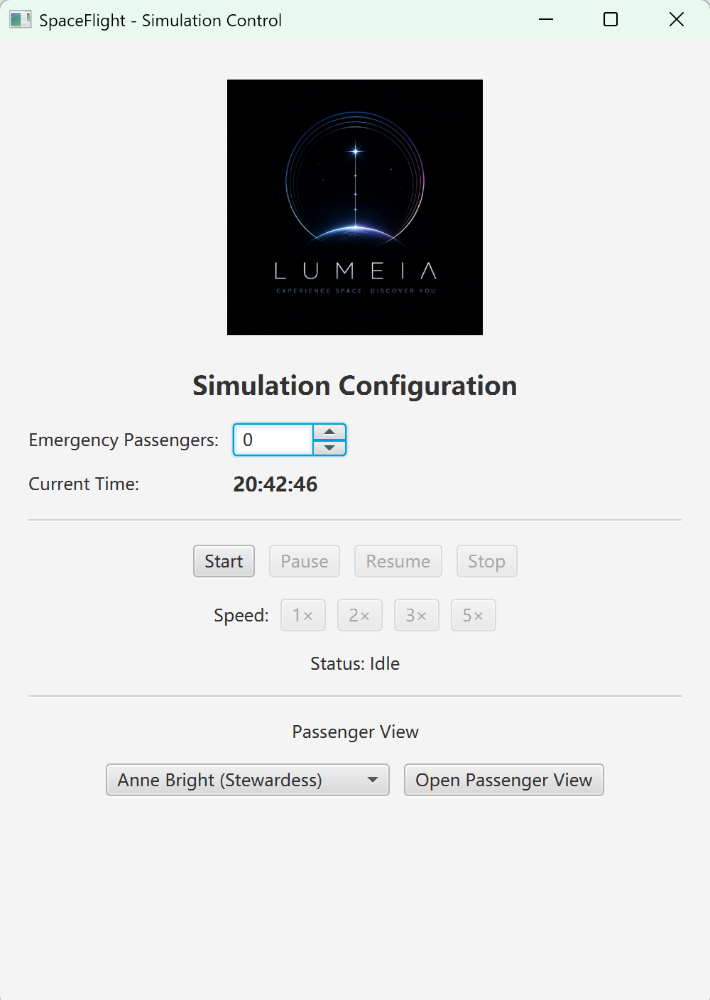

## 2. Simulation Control

The Simulation Control window is the entry point for the demo. It has three jobs:

1. set the number of emergency passengers
2. start, pause, resume, or stop the simulation
3. open passenger or stewardess dashboards

### 2.1 Configuration area

The configuration area contains only these inputs:

- **Emergency Passengers**: spinner from `0` to `6`
- **Current Time**: live clock display

The current time is display-only. You do **not** enter departure or arrival manually in this window.

When you press **Start**:

- the current time becomes the simulation departure time
- the arrival time is set automatically to **10 minutes later**

### 2.2 Simulation controls

Buttons in this window:

- **Start**: starts the simulation and opens the Base Station window
- **Pause**: pauses updates
- **Resume**: continues after a pause
- **Stop**: stops the simulation and returns the control state to idle

Speed buttons:

- **1x**
- **2x**
- **3x**
- **5x**

These speed buttons are disabled until the simulation is running.

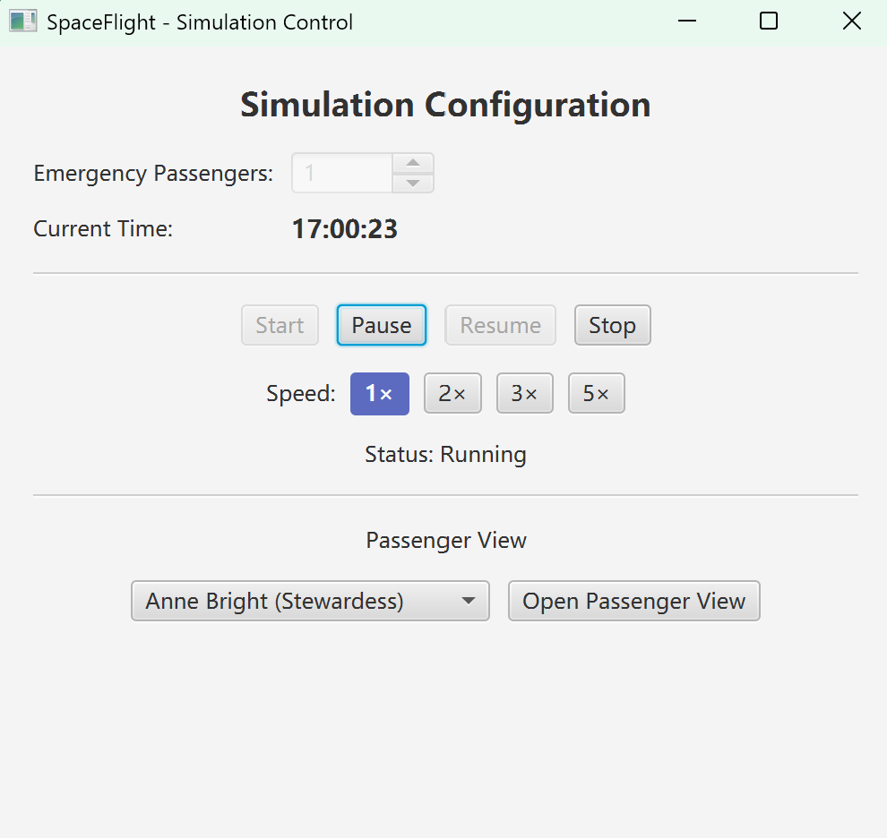

### 2.3 Opening dashboards

The lower part of the window contains:

- a drop-down with all people in the demo
- an **Open Passenger View** button

This is not a clickable list. You select one person from the drop-down, then open that dashboard.

- Selecting **Anne Bright** opens the stewardess dashboard
- Selecting any other person opens a passenger dashboard

You can open multiple dashboards at the same time.

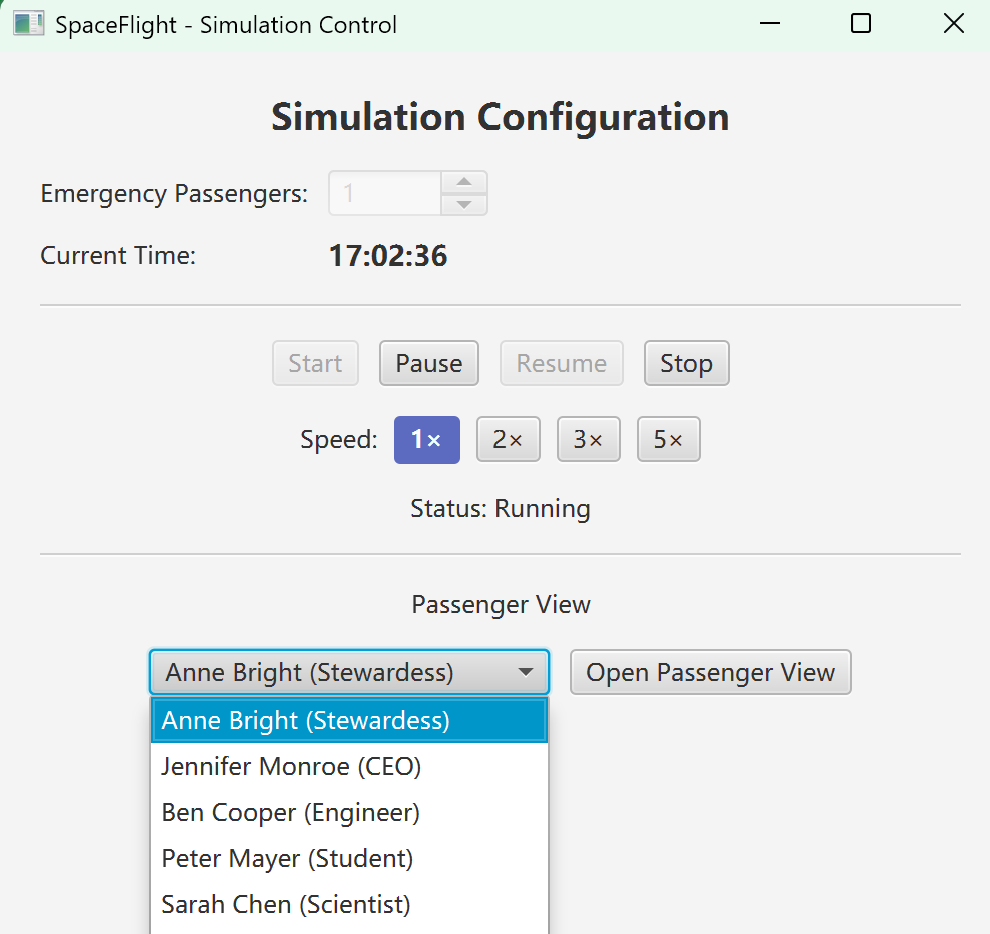

## 3. Base Station

Pressing **Start** opens the Base Station in a separate window.

The navigation bar contains five tabs:

- **Overview**
- **AI Health**
- **Emergency Alert**
- **Psychological Support**
- **User / Settings**

Important: **User / Settings** is currently only a placeholder. The other four tabs are the implemented ones.

### 3.1 Overview

The Overview tab is the default view.


It has two main areas:

- left: **Flight Information**
- right: **Passenger Overview**

#### Flight Information panel

The left panel shows:

- route map
- planned time
- elapsed time
- remaining time
- fuel
- distance
- flight phase
- altitude
- velocity
- emergency landing button


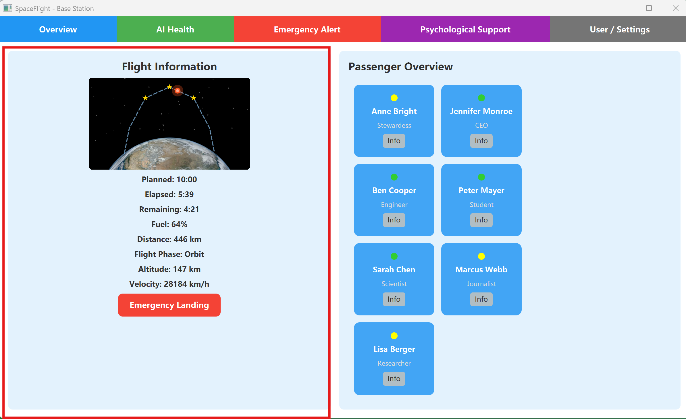

#### Passenger Overview grid

The right side shows a grid of cards. In the current prototype, the grid is built from the full registry, so it can include the stewardess as well as passengers.

Each card contains:

- person name
- role
- status dot
- **Info** button

Card behavior:

- blue background: normal overview state
- red background: active medical alert
- purple background: active psychological support request
- the dot reflects health state when no active incident is overriding the card color

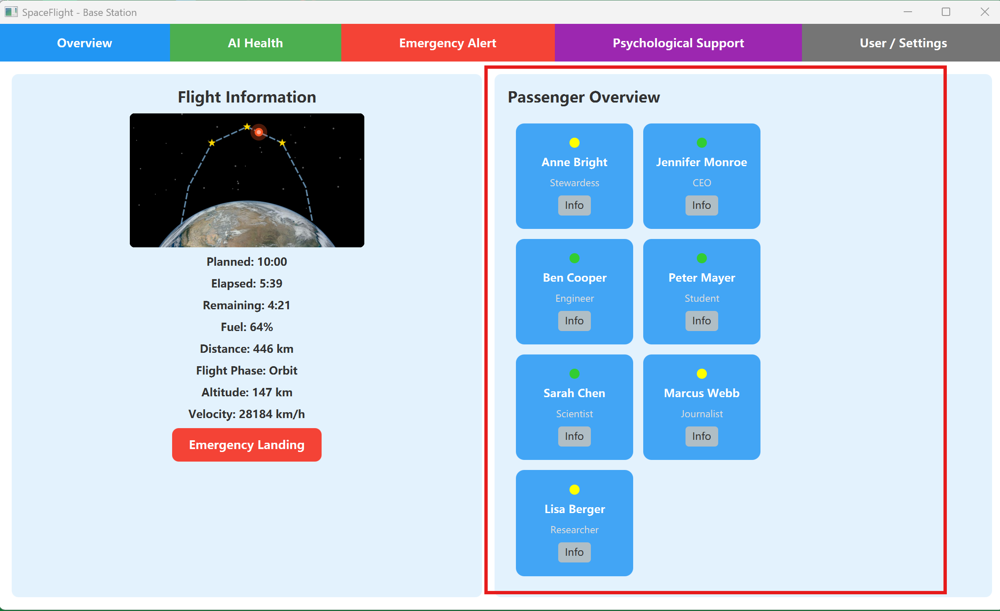

#### Detail view

Press **Info** on any card to replace the overview with a detail panel.

The detail panel shows:

- name
- age
- role
- health status text (`Good`, `Warning`, or `Critical`)
- current vital signs
- experience mode
- alert history for that person

Resolved alerts remain visible in the history and are marked as solved.

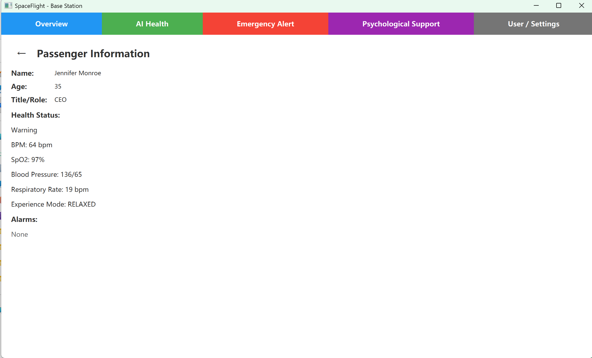

### 3.2 AI Health

The AI Health tab groups people into three columns:

- **CRITICAL**
- **WARNING**
- **STABLE**

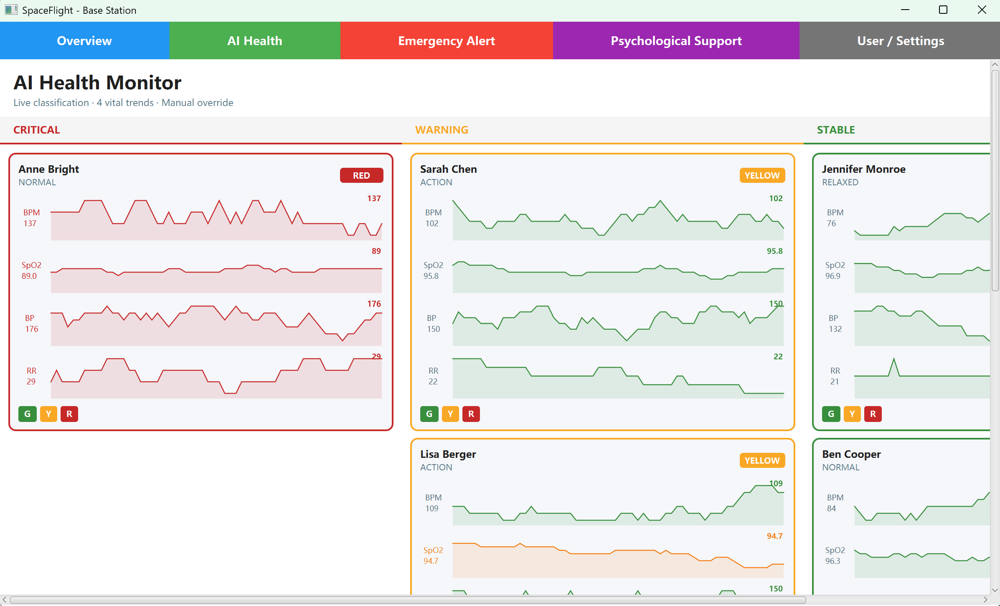

Each card shows:

- person name
- current experience mode
- overall status badge
- four mini trend charts:
  - BPM
  - SpO2
  - BP
  - RR
- current numeric values
- three override buttons:
  - **G**
  - **Y**
  - **R**

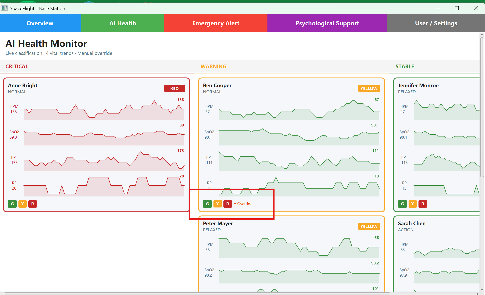

Manual override behavior:

- pressing `G`, `Y`, or `R` sets the health status immediately
- the card shows an override badge
- automatic evaluation skips that person while manual override is active
- there is currently no functionality to end the override (therefore it stays active till the end of the flight)


### 3.3 Emergency Alert

The Emergency Alert tab is titled **Alerts** inside the page.

When no alert is active, the page is mostly empty except for the title.

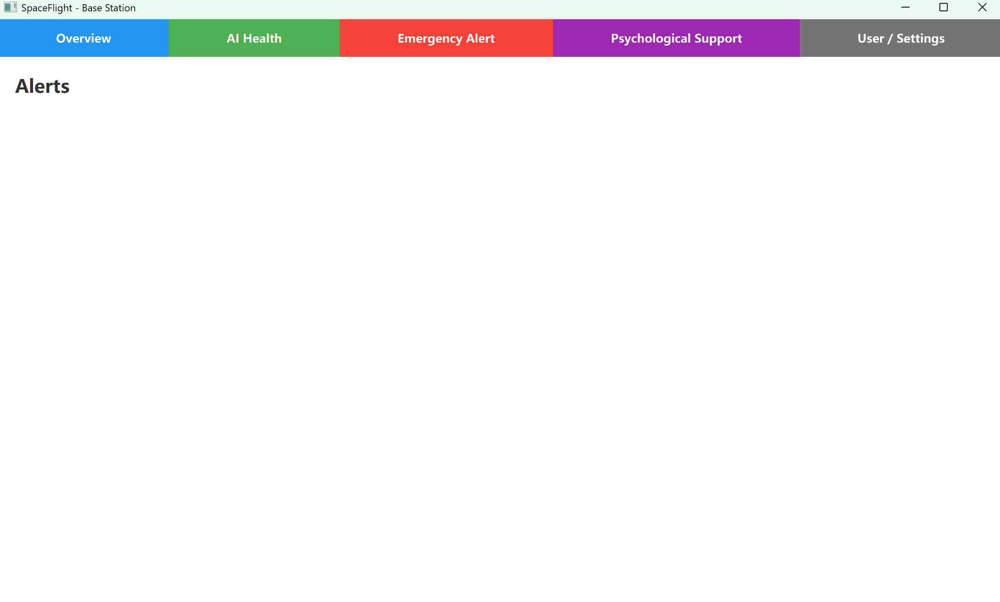

When an alert exists, a card is added.

Each alert card contains:

- passenger name
- fixed severity label `Critical`
- alert reason
- notes text area
- **Send to Stewardess**
- **Solved**

Important details:

- the card does **not** show a timestamp in this view
- **Send to Stewardess** only works when the note field is not empty
- **Solved** resolves the alert immediately

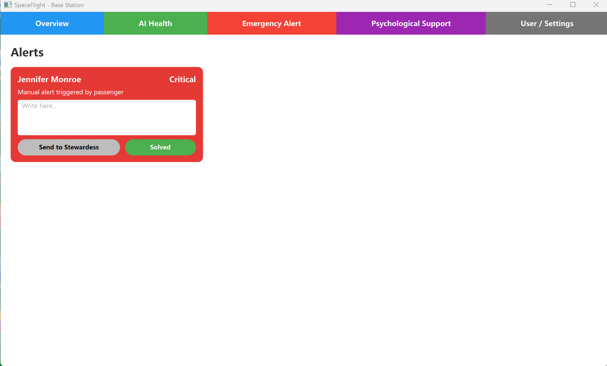

### 3.4 Psychological Support

The Psychological Support tab is titled **Support Requests** inside the page.

When no request is active, the page is mostly empty except for the title.

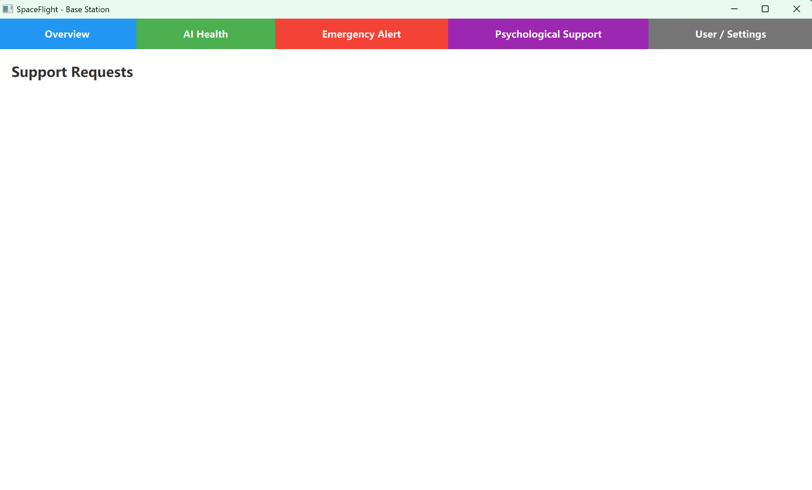

When requests exist, cards are added and sorted by severity:

- HIGH first
- then MEDIUM
- then LOW

Each card contains:

- passenger name
- severity
- passenger message
- notes text area
- **Send to Stewardess**
- **Solved**

Important details:

- this view also does **not** show timestamps on the Base Station card
- **Send to Stewardess** requires a non-empty note

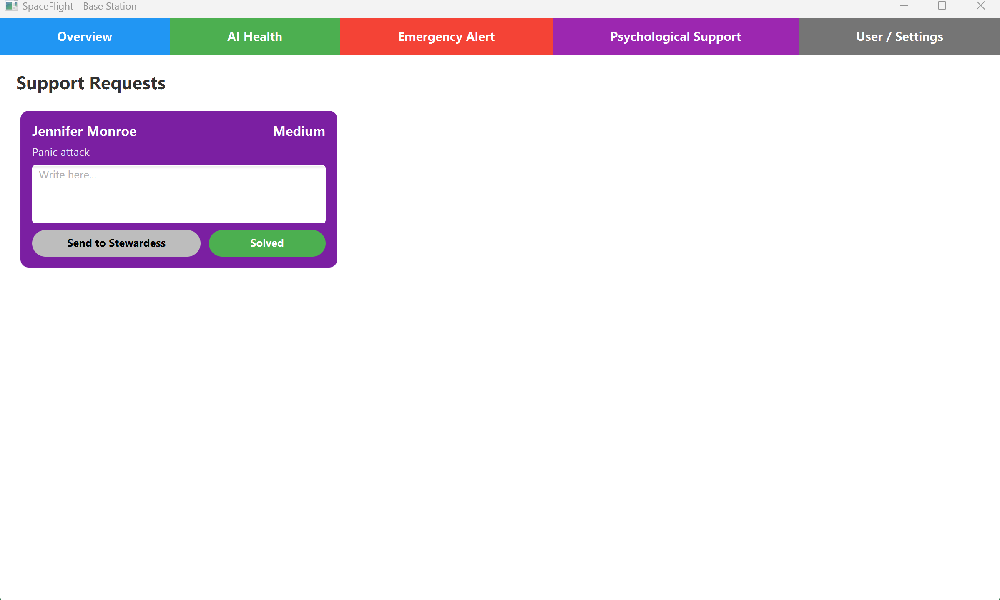

## 4. Passenger Dashboard

Each passenger dashboard has the same overall layout:

- title bar with settings button
- route map
- flight status block
- telemetry strip
- status message area
- right sidebar with schedule, alert controls, and mode controls

### 4.1 Main layout

The passenger dashboard shows:

- route map
- flight phase
- elapsed time
- remaining time
- altitude
- oxygen level
- altitude telemetry box
- velocity
- cabin temperature
- departure time
- arrival time

The passenger dashboard does **not** show fuel or distance.

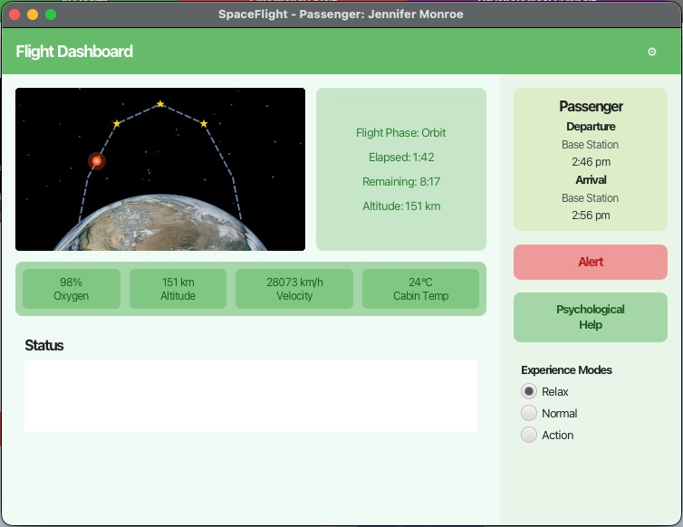

The status area is a running message list. It can contain:

- messages from the Base Station, such as emergency landing notifications
- local confirmations, such as alert triggered or psychological support requested

### 4.2 Experience modes

The three mode options are:

- **Relax**
- **Normal**
- **Action**

Mode switching changes theme and affects health evaluation rules.

#### Relax

- calm visual styling
- psychological help button is visible

The full dashboard screenshot above shows the Relax mode layout.

#### Normal

- neutral visual styling
- psychological help button is hidden

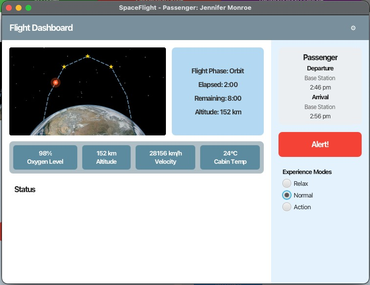

#### Action

- darker visual styling
- psychological help button is hidden

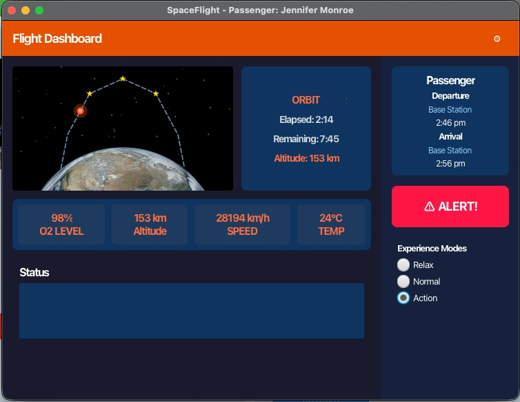

### 4.3 Alert button

The passenger can press **Alert** at any time.

This creates a medical alert with the reason:

`Manual alert triggered by passenger`

Effects:

- the Base Station receives a new alert card
- the passenger card in Overview changes to alert state
- the passenger status area gets a local confirmation message

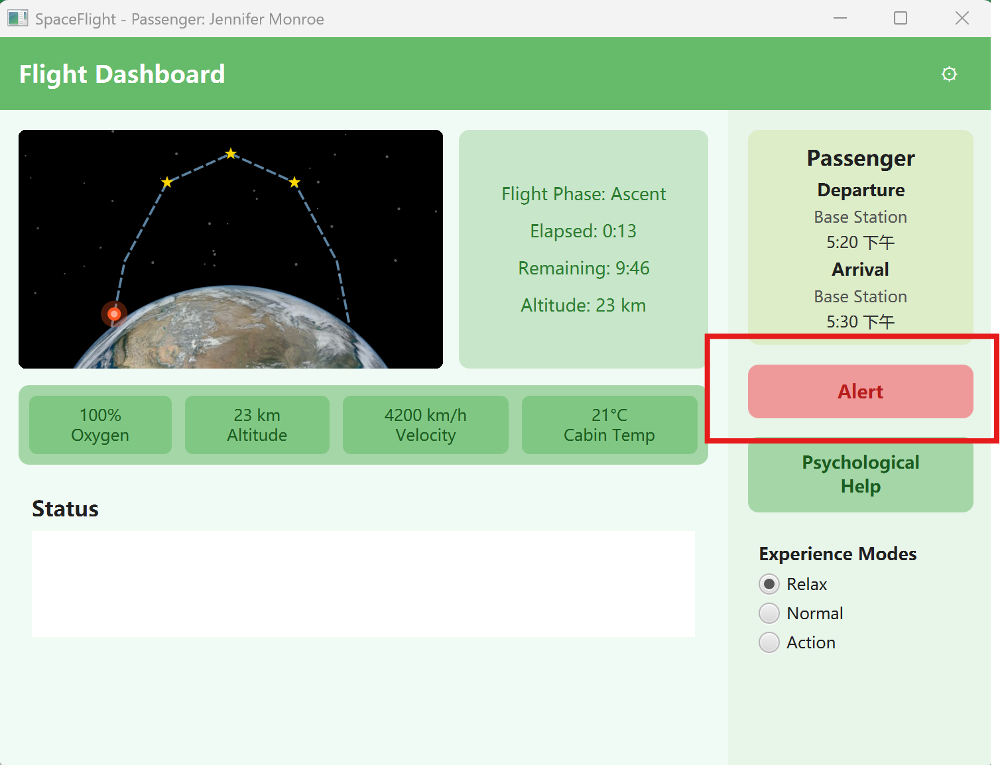

### 4.4 Psychological Help

The psychological help button is available only in **Relax** mode.

When pressed, it opens a dialog where the passenger can choose:

- urgency:
  - **Calm**
  - **Tense**
  - **Panic**
- optional symptom chips:
  - Anxiety
  - Nausea
  - Panic attack
  - Disorientation

These urgency choices map internally to `LOW`, `MEDIUM`, and `HIGH`.

There is no free-text input field in this dialog. The outgoing message is built from the selected symptom chips, or a default message if none are selected.

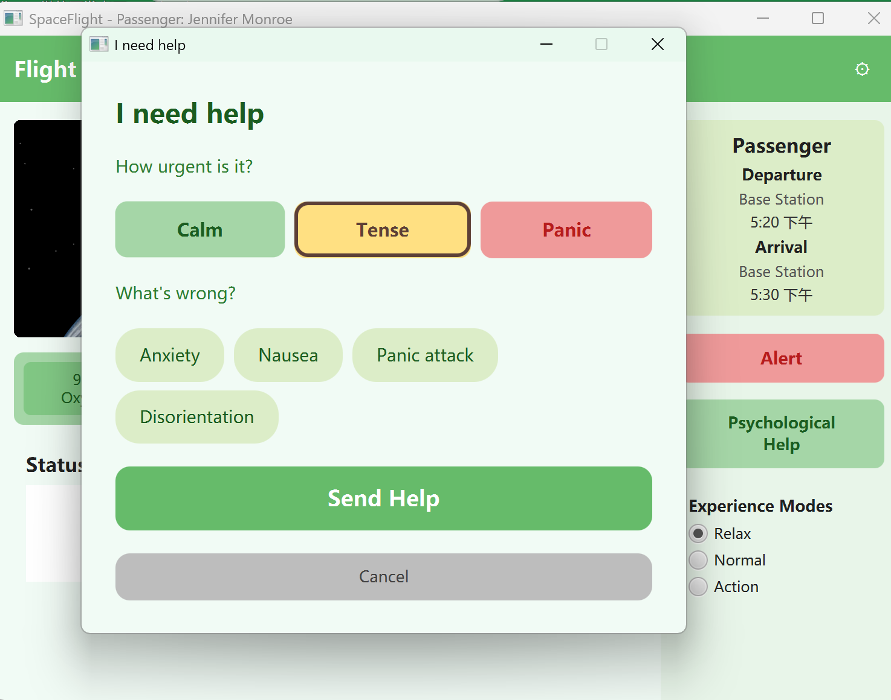

### 4.5 Settings

The top-right settings button opens a dialog with:

- **Volume**: mock control only
- **Brightness**: changes dashboard opacity live
- **Language**: English / Deutsch

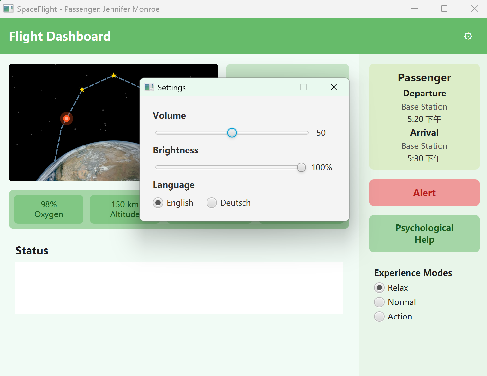

Language switching updates the labels that currently have translations in the passenger dashboard.

## 5. Stewardess Dashboard

Selecting **Anne Bright** in the Simulation Control window opens the stewardess dashboard.

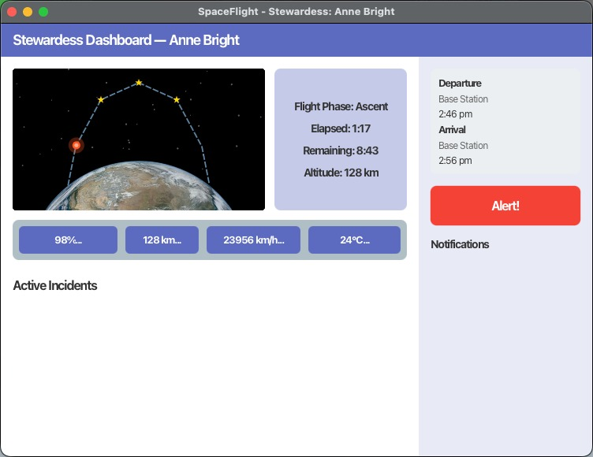

The stewardess dashboard has:

- route map
- flight phase
- elapsed time
- remaining time
- altitude
- telemetry strip
- active incidents area
- schedule sidebar
- stewardess alert button
- notifications area

### 5.1 Notifications vs active incidents

This distinction matters:

- **Notifications** show general events, including emergency landing messages and passenger alerts
- **Active Incidents** only show cards that were explicitly sent from the Base Station with **Send to Stewardess**. The base station always needs to write a message here to send the incident to the stewardess.

### 5.2 Incident cards

Forwarded incident cards contain:

- passenger name
- incident time
- incident reason
- message from Base Station
- current vital signs
- **Solved**

The same layout is used for both medical alerts and psychological support incidents, with different card colors.

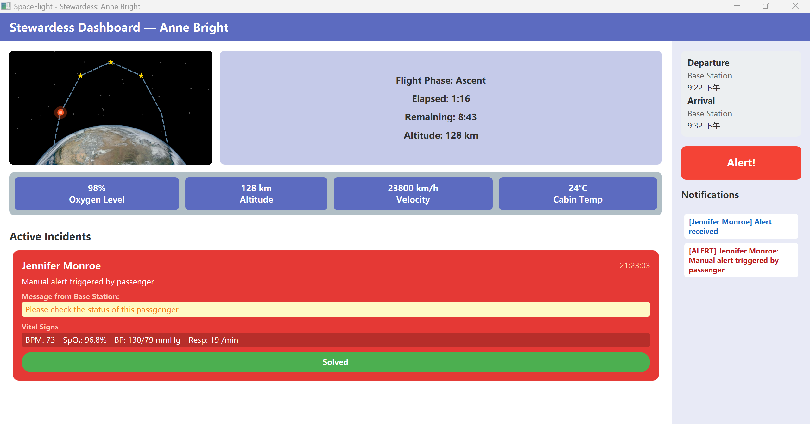

## 6. Common Workflows

### 6.1 Start a demo flight

1. Launch the app.
2. Set **Emergency Passengers** in Simulation Control.
3. Press **Start**.
4. Optionally open passenger or stewardess dashboards from the selector.
5. Use the Base Station tabs to monitor the flight.

### 6.2 Forward a medical alert

1. A passenger presses **Alert**.
2. Open **Emergency Alert** in Base Station.
3. Type a note in the alert card.
4. Press **Send to Stewardess**.
5. The stewardess receives a full incident card.
6. Press **Solved** when the incident is handled.

### 6.3 Forward a psychological support request

1. A passenger in **Relax** mode opens the Psychological Help dialog.
2. The passenger submits the request.
3. The Base Station receives it in **Psychological Support**.
4. Type a note.
5. Press **Send to Stewardess**.
6. The stewardess receives a full incident card.

### 6.4 Emergency landing

1. In Base Station Overview, press **Emergency Landing**.
2. Confirm the dialog.
3. The shuttle switches into emergency descent.
4. Passenger dashboards receive the message `EMERGENCY LANDING initiated!`
5. The stewardess receives a notification in the sidebar.
6. The simulation stops automatically after landing.

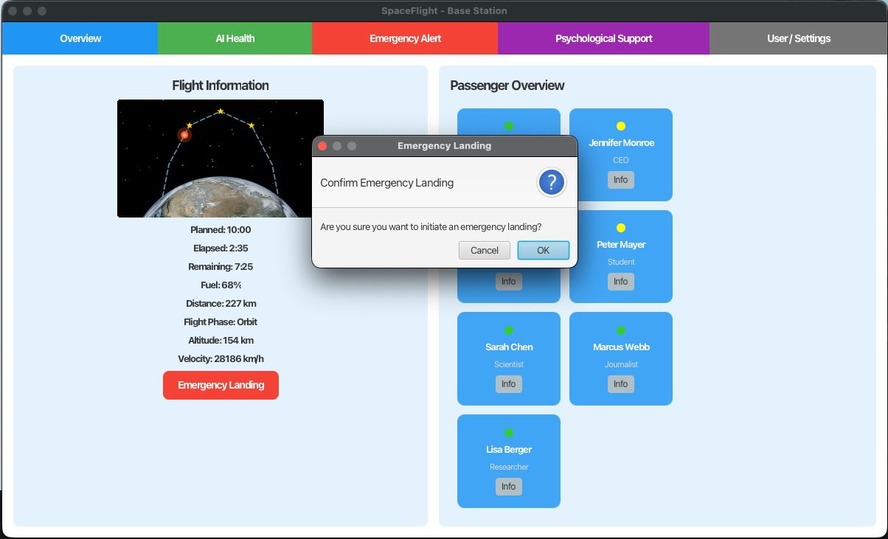

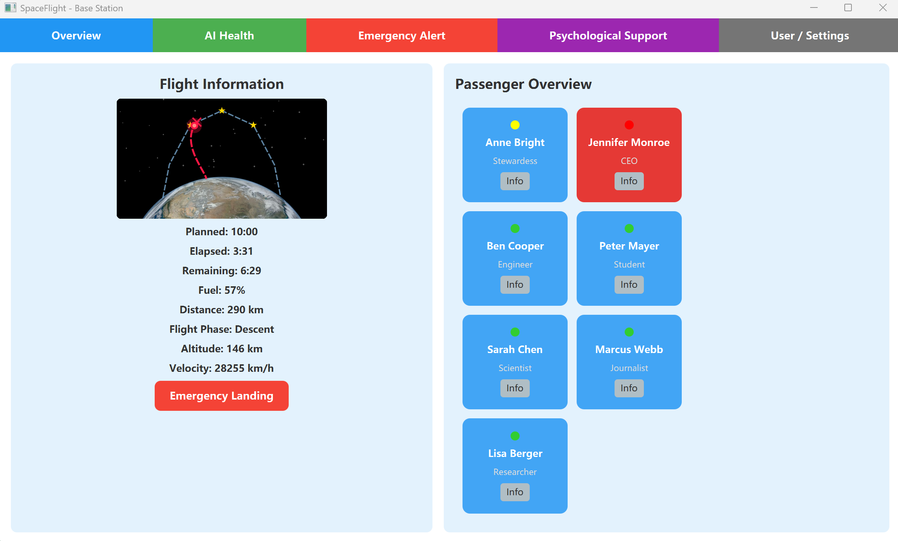

